```python
import pandas as pd
import numpy as np
import matplotlib.pyplot as plt 
import csv
import operator
import random
# from sklearn.model_selection import train_test_split

```


```python
# 导入数据
# data数据尚未进行预处理
data = pd.read_csv("D:\dasanshang\jiqixuexi\P2\winequality-white.csv")
data
```


<div>
<style scoped>
    .dataframe tbody tr th:only-of-type {
        vertical-align: middle;
    }

    .dataframe tbody tr th {
        vertical-align: top;
    }

    .dataframe thead th {
        text-align: right;
    }
</style>
<table border="1" class="dataframe">
  <thead>
    <tr style="text-align: right;">
      <th></th>
      <th>fixed acidity</th>
      <th>volatile acidity</th>
      <th>citric acid</th>
      <th>residual sugar</th>
      <th>chlorides</th>
      <th>free sulfur dioxide</th>
      <th>total sulfur dioxide</th>
      <th>density</th>
      <th>pH</th>
      <th>sulphates</th>
      <th>alcohol</th>
      <th>quality</th>
    </tr>
  </thead>
  <tbody>
    <tr>
      <th>0</th>
      <td>7.0</td>
      <td>0.27</td>
      <td>0.36</td>
      <td>20.7</td>
      <td>0.045</td>
      <td>45.0</td>
      <td>170.0</td>
      <td>1.00100</td>
      <td>3.00</td>
      <td>0.45</td>
      <td>8.8</td>
      <td>6</td>
    </tr>
    <tr>
      <th>1</th>
      <td>6.3</td>
      <td>0.30</td>
      <td>0.34</td>
      <td>1.6</td>
      <td>0.049</td>
      <td>14.0</td>
      <td>132.0</td>
      <td>0.99400</td>
      <td>3.30</td>
      <td>0.49</td>
      <td>9.5</td>
      <td>6</td>
    </tr>
    <tr>
      <th>2</th>
      <td>8.1</td>
      <td>0.28</td>
      <td>0.40</td>
      <td>6.9</td>
      <td>0.050</td>
      <td>30.0</td>
      <td>97.0</td>
      <td>0.99510</td>
      <td>3.26</td>
      <td>0.44</td>
      <td>10.1</td>
      <td>6</td>
    </tr>
    <tr>
      <th>3</th>
      <td>7.2</td>
      <td>0.23</td>
      <td>0.32</td>
      <td>8.5</td>
      <td>0.058</td>
      <td>47.0</td>
      <td>186.0</td>
      <td>0.99560</td>
      <td>3.19</td>
      <td>0.40</td>
      <td>9.9</td>
      <td>6</td>
    </tr>
    <tr>
      <th>4</th>
      <td>7.2</td>
      <td>0.23</td>
      <td>0.32</td>
      <td>8.5</td>
      <td>0.058</td>
      <td>47.0</td>
      <td>186.0</td>
      <td>0.99560</td>
      <td>3.19</td>
      <td>0.40</td>
      <td>9.9</td>
      <td>6</td>
    </tr>
    <tr>
      <th>...</th>
      <td>...</td>
      <td>...</td>
      <td>...</td>
      <td>...</td>
      <td>...</td>
      <td>...</td>
      <td>...</td>
      <td>...</td>
      <td>...</td>
      <td>...</td>
      <td>...</td>
      <td>...</td>
    </tr>
    <tr>
      <th>4893</th>
      <td>6.2</td>
      <td>0.21</td>
      <td>0.29</td>
      <td>1.6</td>
      <td>0.039</td>
      <td>24.0</td>
      <td>92.0</td>
      <td>0.99114</td>
      <td>3.27</td>
      <td>0.50</td>
      <td>11.2</td>
      <td>6</td>
    </tr>
    <tr>
      <th>4894</th>
      <td>6.6</td>
      <td>0.32</td>
      <td>0.36</td>
      <td>8.0</td>
      <td>0.047</td>
      <td>57.0</td>
      <td>168.0</td>
      <td>0.99490</td>
      <td>3.15</td>
      <td>0.46</td>
      <td>9.6</td>
      <td>5</td>
    </tr>
    <tr>
      <th>4895</th>
      <td>6.5</td>
      <td>0.24</td>
      <td>0.19</td>
      <td>1.2</td>
      <td>0.041</td>
      <td>30.0</td>
      <td>111.0</td>
      <td>0.99254</td>
      <td>2.99</td>
      <td>0.46</td>
      <td>9.4</td>
      <td>6</td>
    </tr>
    <tr>
      <th>4896</th>
      <td>5.5</td>
      <td>0.29</td>
      <td>0.30</td>
      <td>1.1</td>
      <td>0.022</td>
      <td>20.0</td>
      <td>110.0</td>
      <td>0.98869</td>
      <td>3.34</td>
      <td>0.38</td>
      <td>12.8</td>
      <td>7</td>
    </tr>
    <tr>
      <th>4897</th>
      <td>6.0</td>
      <td>0.21</td>
      <td>0.38</td>
      <td>0.8</td>
      <td>0.020</td>
      <td>22.0</td>
      <td>98.0</td>
      <td>0.98941</td>
      <td>3.26</td>
      <td>0.32</td>
      <td>11.8</td>
      <td>6</td>
    </tr>
  </tbody>
</table>
<p>4898 rows × 12 columns</p>
</div>


```python
# 数据预处理
# 中心化代码
def Normalization_fun(x):
    # 特征零均值
    x = (x - np.mean(x, 0)) / (np.max(x, 0) - np.min(x, 0))
    return x

# 提取特征和标签
X = data.iloc[:, 0:-1]  # N D
X = Normalization_fun(X)
Y = data.iloc[:, -1]

# 测试X，Y
print(X)
print(Y)
```

          fixed acidity  volatile acidity  citric acid  residual sugar  chlorides  \
    0          0.013963         -0.008080     0.015547        0.219457  -0.002292   
    1         -0.053345          0.021332     0.003499       -0.073488   0.009578   
    2          0.119732          0.001724     0.039644        0.007800   0.012545   
    3          0.033193         -0.047295    -0.008549        0.032340   0.036284   
    4          0.033193         -0.047295    -0.008549        0.032340   0.036284   
    ...             ...               ...          ...             ...        ...   
    4893      -0.062960         -0.066903    -0.026621       -0.073488  -0.020096   
    4894      -0.024499          0.040940     0.015547        0.024672   0.003643   
    4895      -0.034114         -0.037491    -0.086862       -0.079623  -0.014161   
    4896      -0.130268          0.011528    -0.020597       -0.081157  -0.070541   
    4897      -0.082191         -0.066903     0.027595       -0.085758  -0.076476   
    
          free sulfur dioxide  total sulfur dioxide   density        pH  \
    0                0.033770              0.073409  0.134425 -0.171151   
    1               -0.074244             -0.014758 -0.000528  0.101576   
    2               -0.018495             -0.095964  0.020679  0.065212   
    3                0.040738              0.110532  0.030319  0.001576   
    4                0.040738              0.110532  0.030319  0.001576   
    ...                   ...                   ...       ...       ...   
    4893            -0.039401             -0.107565 -0.055666  0.074303   
    4894             0.075582              0.068769  0.016823 -0.034788   
    4895            -0.018495             -0.063482 -0.028675 -0.180242   
    4896            -0.053338             -0.065802 -0.102899  0.137939   
    4897            -0.046370             -0.093644 -0.089018  0.065212   
    
          sulphates   alcohol  
    0     -0.046334 -0.276495  
    1      0.000178 -0.163591  
    2     -0.057961 -0.066817  
    3     -0.104473 -0.099075  
    4     -0.104473 -0.099075  
    ...         ...       ...  
    4893   0.011806  0.110602  
    4894  -0.034706 -0.147462  
    4895  -0.034706 -0.179720  
    4896  -0.127729  0.368667  
    4897  -0.197496  0.207376  
    
    [4898 rows x 11 columns]
    0       6
    1       6
    2       6
    3       6
    4       6
           ..
    4893    6
    4894    5
    4895    6
    4896    7
    4897    6
    Name: quality, Length: 4898, dtype: int64
    


```python
# 可视化中心化后的sulphates特征
import matplotlib.pyplot as plt
plt.hist(X["sulphates"])
plt.show()
```


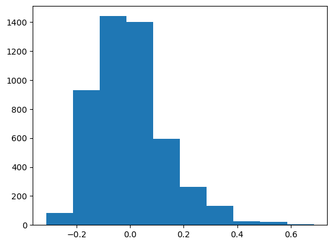


```python
# 这里注意一个小trick：回归系数会比特征x多一维，为了向量相乘方便，可以在训练集X左侧添加全为1的一列
# data0为处理好的所有列
data0 = pd.concat([pd.DataFrame(np.ones(X.shape[0]), columns=['x0']), X], axis=1)
data0
```


<div>
<style scoped>
    .dataframe tbody tr th:only-of-type {
        vertical-align: middle;
    }

    .dataframe tbody tr th {
        vertical-align: top;
    }

    .dataframe thead th {
        text-align: right;
    }
</style>
<table border="1" class="dataframe">
  <thead>
    <tr style="text-align: right;">
      <th></th>
      <th>x0</th>
      <th>fixed acidity</th>
      <th>volatile acidity</th>
      <th>citric acid</th>
      <th>residual sugar</th>
      <th>chlorides</th>
      <th>free sulfur dioxide</th>
      <th>total sulfur dioxide</th>
      <th>density</th>
      <th>pH</th>
      <th>sulphates</th>
      <th>alcohol</th>
    </tr>
  </thead>
  <tbody>
    <tr>
      <th>0</th>
      <td>1.0</td>
      <td>0.013963</td>
      <td>-0.008080</td>
      <td>0.015547</td>
      <td>0.219457</td>
      <td>-0.002292</td>
      <td>0.033770</td>
      <td>0.073409</td>
      <td>0.134425</td>
      <td>-0.171151</td>
      <td>-0.046334</td>
      <td>-0.276495</td>
    </tr>
    <tr>
      <th>1</th>
      <td>1.0</td>
      <td>-0.053345</td>
      <td>0.021332</td>
      <td>0.003499</td>
      <td>-0.073488</td>
      <td>0.009578</td>
      <td>-0.074244</td>
      <td>-0.014758</td>
      <td>-0.000528</td>
      <td>0.101576</td>
      <td>0.000178</td>
      <td>-0.163591</td>
    </tr>
    <tr>
      <th>2</th>
      <td>1.0</td>
      <td>0.119732</td>
      <td>0.001724</td>
      <td>0.039644</td>
      <td>0.007800</td>
      <td>0.012545</td>
      <td>-0.018495</td>
      <td>-0.095964</td>
      <td>0.020679</td>
      <td>0.065212</td>
      <td>-0.057961</td>
      <td>-0.066817</td>
    </tr>
    <tr>
      <th>3</th>
      <td>1.0</td>
      <td>0.033193</td>
      <td>-0.047295</td>
      <td>-0.008549</td>
      <td>0.032340</td>
      <td>0.036284</td>
      <td>0.040738</td>
      <td>0.110532</td>
      <td>0.030319</td>
      <td>0.001576</td>
      <td>-0.104473</td>
      <td>-0.099075</td>
    </tr>
    <tr>
      <th>4</th>
      <td>1.0</td>
      <td>0.033193</td>
      <td>-0.047295</td>
      <td>-0.008549</td>
      <td>0.032340</td>
      <td>0.036284</td>
      <td>0.040738</td>
      <td>0.110532</td>
      <td>0.030319</td>
      <td>0.001576</td>
      <td>-0.104473</td>
      <td>-0.099075</td>
    </tr>
    <tr>
      <th>...</th>
      <td>...</td>
      <td>...</td>
      <td>...</td>
      <td>...</td>
      <td>...</td>
      <td>...</td>
      <td>...</td>
      <td>...</td>
      <td>...</td>
      <td>...</td>
      <td>...</td>
      <td>...</td>
    </tr>
    <tr>
      <th>4893</th>
      <td>1.0</td>
      <td>-0.062960</td>
      <td>-0.066903</td>
      <td>-0.026621</td>
      <td>-0.073488</td>
      <td>-0.020096</td>
      <td>-0.039401</td>
      <td>-0.107565</td>
      <td>-0.055666</td>
      <td>0.074303</td>
      <td>0.011806</td>
      <td>0.110602</td>
    </tr>
    <tr>
      <th>4894</th>
      <td>1.0</td>
      <td>-0.024499</td>
      <td>0.040940</td>
      <td>0.015547</td>
      <td>0.024672</td>
      <td>0.003643</td>
      <td>0.075582</td>
      <td>0.068769</td>
      <td>0.016823</td>
      <td>-0.034788</td>
      <td>-0.034706</td>
      <td>-0.147462</td>
    </tr>
    <tr>
      <th>4895</th>
      <td>1.0</td>
      <td>-0.034114</td>
      <td>-0.037491</td>
      <td>-0.086862</td>
      <td>-0.079623</td>
      <td>-0.014161</td>
      <td>-0.018495</td>
      <td>-0.063482</td>
      <td>-0.028675</td>
      <td>-0.180242</td>
      <td>-0.034706</td>
      <td>-0.179720</td>
    </tr>
    <tr>
      <th>4896</th>
      <td>1.0</td>
      <td>-0.130268</td>
      <td>0.011528</td>
      <td>-0.020597</td>
      <td>-0.081157</td>
      <td>-0.070541</td>
      <td>-0.053338</td>
      <td>-0.065802</td>
      <td>-0.102899</td>
      <td>0.137939</td>
      <td>-0.127729</td>
      <td>0.368667</td>
    </tr>
    <tr>
      <th>4897</th>
      <td>1.0</td>
      <td>-0.082191</td>
      <td>-0.066903</td>
      <td>0.027595</td>
      <td>-0.085758</td>
      <td>-0.076476</td>
      <td>-0.046370</td>
      <td>-0.093644</td>
      <td>-0.089018</td>
      <td>0.065212</td>
      <td>-0.197496</td>
      <td>0.207376</td>
    </tr>
  </tbody>
</table>
<p>4898 rows × 12 columns</p>
</div>


```python
print(Y)
```

    0       6
    1       6
    2       6
    3       6
    4       6
           ..
    4893    6
    4894    5
    4895    6
    4896    7
    4897    6
    Name: quality, Length: 4898, dtype: int64
    


```python
# 初始化回归系数
W_init = np.random.randn(data0.shape[1], 1)
W_init
```


    array([[-0.08543823],
           [-0.43622065],
           [-0.12327439],
           [-1.23013887],
           [-0.86821258],
           [ 1.26888611],
           [ 0.52992479],
           [-0.39588687],
           [ 0.77449572],
           [-0.91705085],
           [ 1.32479824],
           [ 0.18579127]])


```python
# 初始化回归系数
W_init = np.random.randn(data0.shape[1], 1)
W_init
```


    array([[-0.25234852],
           [ 1.55396268],
           [ 0.21944025],
           [ 0.49209567],
           [-1.01790253],
           [ 1.26405492],
           [-0.70120611],
           [ 1.1282799 ],
           [-1.2512353 ],
           [ 0.13211097],
           [ 1.555655  ],
           [-0.67651714]])


```python
# 测试内容
print(data0['x0'][4])

print(W_init[1])
```

    1.0
    [1.55396268]
    


```python
# 4:1划分训练集和测试集，这个操作对我是真的难！！！
# x_train, x_test, y_train, y_test = train_test_split(dataset, y, test_size = 0.2) #划分训练集
gbr = data.groupby('quality')  # 用分组函数groupby()进行数据的分组，分组依据为'TYPE'这一属性
gbr.groups    # 获取分组后gbr的数据
```


    {3: [251, 253, 294, 445, 740, 873, 1034, 1229, 1417, 1484, 1688, 1931, 2050, 2373, 3087, 3265, 3307, 3409, 3810, 4745], 4: [46, 98, 115, 147, 172, 176, 178, 189, 204, 207, 230, 250, 259, 278, 282, 433, 496, 499, 526, 540, 626, 641, 646, 659, 662, 687, 690, 702, 780, 831, 905, 906, 908, 914, 948, 991, 993, 1027, 1029, 1040, 1042, 1053, 1059, 1109, 1114, 1152, 1154, 1155, 1245, 1293, 1294, 1349, 1363, 1405, 1420, 1423, 1430, 1474, 1483, 1541, 1558, 1559, 1574, 1577, 1579, 1649, 1652, 1664, 1690, 1702, 1708, 1718, 1739, 1781, 1817, 1856, 1924, 1951, 1990, 2079, 2116, 2119, 2154, 2156, 2159, 2225, 2237, 2246, 2275, 2318, 2337, 2346, 2372, 2379, 2380, 2386, 2387, 2388, 2400, 2401, ...], 5: [10, 11, 12, 14, 19, 23, 34, 35, 36, 38, 39, 47, 49, 62, 65, 67, 69, 71, 72, 75, 78, 79, 82, 84, 88, 91, 100, 101, 102, 103, 104, 106, 109, 111, 112, 113, 114, 118, 119, 120, 121, 122, 126, 130, 132, 133, 134, 135, 137, 140, 141, 153, 161, 162, 164, 165, 168, 169, 174, 177, 181, 182, 184, 185, 187, 191, 193, 194, 196, 197, 198, 199, 200, 201, 202, 205, 206, 208, 210, 212, 215, 216, 217, 218, 219, 220, 225, 229, 240, 241, 244, 249, 252, 261, 262, 265, 267, 271, 272, 273, ...], 6: [0, 1, 2, 3, 4, 5, 6, 7, 8, 9, 16, 18, 24, 25, 26, 27, 28, 30, 31, 32, 33, 37, 40, 41, 42, 43, 44, 48, 50, 53, 54, 55, 56, 57, 58, 59, 60, 61, 63, 64, 70, 73, 80, 81, 83, 85, 86, 87, 89, 90, 95, 96, 99, 105, 107, 108, 110, 116, 117, 123, 124, 125, 129, 136, 139, 142, 143, 144, 145, 146, 149, 151, 152, 154, 155, 156, 163, 166, 170, 171, 175, 179, 180, 183, 186, 190, 192, 195, 203, 209, 213, 221, 223, 224, 226, 227, 228, 231, 232, 233, ...], 7: [13, 15, 21, 29, 45, 51, 52, 66, 76, 77, 92, 93, 94, 97, 127, 128, 131, 138, 148, 150, 157, 160, 167, 173, 211, 214, 222, 238, 242, 246, 247, 248, 256, 257, 279, 287, 288, 289, 290, 293, 297, 308, 310, 318, 320, 339, 340, 346, 350, 351, 353, 364, 365, 374, 375, 376, 377, 379, 380, 384, 385, 386, 389, 390, 406, 420, 424, 432, 435, 438, 440, 449, 452, 453, 454, 456, 473, 476, 491, 507, 509, 514, 548, 550, 551, 552, 553, 554, 555, 560, 563, 571, 573, 574, 577, 578, 579, 584, 587, 588, ...], 8: [17, 20, 22, 68, 74, 158, 159, 188, 255, 280, 281, 311, 330, 434, 437, 442, 598, 610, 625, 672, 723, 779, 783, 799, 832, 835, 836, 837, 838, 844, 845, 860, 867, 879, 904, 907, 924, 1022, 1086, 1087, 1095, 1106, 1115, 1136, 1137, 1187, 1216, 1218, 1219, 1266, 1283, 1306, 1333, 1336, 1344, 1345, 1348, 1358, 1402, 1403, 1406, 1412, 1464, 1493, 1494, 1504, 1619, 1632, 1665, 1715, 1723, 1778, 1779, 1797, 1980, 1981, 1982, 1983, 1984, 1991, 2298, 2333, 2342, 2382, 2384, 2389, 2390, 2522, 2525, 2663, 2748, 2750, 2753, 2774, 2775, 2776, 2795, 2803, 2804, 2857, ...], 9: [774, 820, 827, 876, 1605]}


```python
# 划分各组长度，并将其存入数组
print(len(gbr.groups[3]))
print(len(gbr.groups))
print('-----------------------------------------------------')
for i in range(3, 10):
    print(i)
print('-----------------------------------------------------')
    
x = 0
every_len = []

for i in range(3, 10):
    x += len(gbr.groups[i])
    every_len.append(len(gbr.groups[i]))
    print(len(gbr.groups[i]))
    
print('-----------------------------------------------------')
    
print(x)
print(every_len)
```

    20
    7
    -----------------------------------------------------
    3
    4
    5
    6
    7
    8
    9
    -----------------------------------------------------
    20
    163
    1457
    2198
    880
    175
    5
    -----------------------------------------------------
    4898
    [20, 163, 1457, 2198, 880, 175, 5]
    


```python
train_rate = 0.8    # 所有数据中80%作为训练数据集，20%作为测试数据集
num_tup = np.array(every_len)   # 全部数据中7种酒的质量的元组数
num_train_tup = np.array([(int)(round(i*train_rate)) for i in num_tup])   # round函数对数进行四舍五入处理
num_test_tup = num_tup - num_train_tup
print(num_train_tup)
print(num_test_tup)
```

    [  16  130 1166 1758  704  140    4]
    [  4  33 291 440 176  35   1]
    


```python
# 定义分层抽样的字典，格式为：组名：数据个数
typicalNDict_train = {3: num_train_tup[0], 4: num_train_tup[1], 5: num_train_tup[2], 6: num_train_tup[3],
                      7: num_train_tup[4], 8: num_train_tup[5], 9: num_train_tup[6]}  # 此处要根据不同的地物类型的总数设置抽样的数据
typicalNDict_test = {3: num_test_tup[0], 4: num_test_tup[1], 5: num_test_tup[2], 6: num_test_tup[3],
                      7: num_test_tup[4], 8: num_test_tup[5], 9: num_test_tup[6]}  # 此处要根据不同的地物类型的总数设置抽样的数据
print(typicalNDict_train)
print(typicalNDict_test)
```

    {3: 16, 4: 130, 5: 1166, 6: 1758, 7: 704, 8: 140, 9: 4}
    {3: 4, 4: 33, 5: 291, 6: 440, 7: 176, 8: 35, 9: 1}
    


```python
# 测试随机生成数
resultList = random.sample(range(0,20), 16)
print(resultList)
```

    [13, 10, 19, 4, 14, 2, 1, 8, 16, 11, 0, 18, 15, 9, 3, 5]
    


```python
# 开始生成训练集和测试集的前面序号的list
train_list = []
test_list = []

for i in range(3, 10):
    mid_list = random.sample(range(0, len(gbr.groups[i])), typicalNDict_train[i])
    # mid_list = random.sample(range(0, len(gbr.groups[i]), typicalNDict_train[i])
    
    for j in range(0, len(gbr.groups[i])):
        if j in mid_list:
            train_list.append(gbr.groups[i][j])
        else:
            test_list.append(gbr.groups[i][j])
        
# print(train_list)
# print(test_list)
print('-----------------------------------------------------')
print(len(train_list))
print(len(test_list))
print('-----------------------------------------------------')
# train_list.sort()
# print(train_list)
# test_list.sort()
# print(test_list)
```

    -----------------------------------------------------
    3918
    980
    -----------------------------------------------------
    


```python
# 测试iloc,发现逗号前面的数据即为所有的行，而后面的数据即为所有的列，nice!
test_z = X.iloc[[0,1],:]
print(test_z)
```

       fixed acidity  volatile acidity  citric acid  residual sugar  chlorides  \
    0       0.013963         -0.008080     0.015547        0.219457  -0.002292   
    1      -0.053345          0.021332     0.003499       -0.073488   0.009578   
    
       free sulfur dioxide  total sulfur dioxide   density        pH  sulphates  \
    0             0.033770              0.073409  0.134425 -0.171151  -0.046334   
    1            -0.074244             -0.014758 -0.000528  0.101576   0.000178   
    
        alcohol  
    0 -0.276495  
    1 -0.163591  
    


```python
# 开始分层抽样实现生成测试集80%和训练集20%，助教学长这里要给我加分呀
x_train = data0.iloc[train_list, :]
x_test = data0.iloc[test_list, :]
print(x_train)
print('------------------------------------------------------------------------------------------------')
print(x_test)
print('------------------------------------------------------------------------------------------------')
y_train = Y.iloc[train_list]
y_test = Y.iloc[test_list]
print(y_train)
print('------------------------------------------------------------------------------------------------')
print(y_test)
```

           x0  fixed acidity  volatile acidity  citric acid  residual sugar  \
    251   1.0       0.158193         -0.017883    -0.074814        0.150438   
    294   1.0       0.215886          0.305646     0.027595       -0.073488   
    445   1.0       0.023578          0.040940    -0.008549        0.070684   
    740   1.0       0.004347          0.109568     0.039644       -0.027476   
    873   1.0       0.331270         -0.106119     0.081812       -0.076555   
    ...   ...            ...               ...          ...             ...   
    4802  1.0      -0.101422          0.001724     0.003499       -0.064286   
    774   1.0       0.215886         -0.008080     0.069764        0.064549   
    827   1.0       0.052424         -0.037491     0.015547       -0.067353   
    876   1.0       0.004347          0.080156     0.003499       -0.033611   
    1605  1.0       0.023578         -0.017883     0.093861       -0.064286   
    
          chlorides  free sulfur dioxide  total sulfur dioxide   density  \
    251    0.083762             0.019832              0.136054  0.076588   
    294    0.060023            -0.004558              0.101251  0.053453   
    445   -0.023063            -0.067276             -0.167890 -0.006311   
    740   -0.070541            -0.105603             -0.276939 -0.048725   
    873   -0.026031            -0.105603             -0.244456 -0.002456   
    ...         ...                  ...                   ...       ...   
    4802  -0.026031            -0.039401             -0.030999 -0.080343   
    774   -0.031965            -0.025464             -0.033319  0.057309   
    827   -0.043835            -0.028948              0.001483 -0.067040   
    876   -0.082411             0.075582             -0.044920 -0.081499   
    1605  -0.040868            -0.015011             -0.058841 -0.071860   
    
                pH  sulphates   alcohol  
    251  -0.152970   0.011806 -0.115204  
    294   0.037939  -0.127729 -0.324882  
    445   0.047030  -0.104473  0.158989  
    740   0.110667  -0.139357  0.336409  
    873  -0.271151  -0.244008 -0.147462  
    ...        ...        ...       ...  
    4802  0.156121  -0.185868  0.368667  
    774   0.010667  -0.034706 -0.018430  
    827   0.083394  -0.011450  0.320280  
    876   0.083394  -0.150985  0.352538  
    1605  0.165212  -0.081217  0.384796  
    
    [3918 rows x 12 columns]
    ------------------------------------------------------------------------------------------------
           x0  fixed acidity  volatile acidity  citric acid  residual sugar  \
    253   1.0      -0.101422         -0.037491     0.063740       -0.044347   
    1034  1.0       0.100501          0.354666     0.075788        0.064549   
    1417  1.0       0.167809          0.266430     0.009523        0.140469   
    1688  1.0      -0.014883         -0.027687    -0.044694       -0.074255   
    46    1.0      -0.062960          0.168391    -0.044694       -0.030543   
    ...   ...            ...               ...          ...             ...   
    3665  1.0      -0.139883          0.246822    -0.104935       -0.056617   
    3689  1.0       0.013963         -0.057099    -0.044694        0.043076   
    3754  1.0      -0.139883          0.178195    -0.110959       -0.065819   
    4333  1.0       0.042809         -0.086511    -0.038670        0.115162   
    820   1.0      -0.024499          0.080156    -0.026621       -0.073488   
    
          chlorides  free sulfur dioxide  total sulfur dioxide   density  \
    253   -0.049770            -0.105603             -0.068122 -0.052581   
    1034   0.588213            -0.008042              0.205660  0.082372   
    1417   0.033316             0.000669              0.529326  0.117074   
    1688  -0.014161             0.289867              0.180138  0.016823   
    46     0.051121             0.096488              0.156936 -0.000528   
    ...         ...                  ...                   ...       ...   
    3665  -0.028998            -0.004558             -0.024039 -0.105405   
    3689  -0.055704             0.005895             -0.037960 -0.033688   
    3754  -0.058672            -0.021979             -0.019398 -0.086705   
    4333   0.033316             0.033770              0.038606  0.077938   
    820   -0.073508            -0.039401             -0.123807 -0.084391   
    
                pH  sulphates   alcohol  
    253   0.310667  -0.069589  0.191247  
    1034 -0.289333   0.290876 -0.228108  
    1417 -0.134788   0.162969  0.078344  
    1688  0.328849   0.162969 -0.179720  
    46    0.074303   0.035062 -0.115204  
    ...        ...        ...       ...  
    3665  0.010667   0.046690  0.433183  
    3689 -0.116606  -0.174241  0.320280  
    3754  0.183394   0.325759  0.465441  
    4333 -0.225697  -0.092845 -0.276495  
    820   0.201576   0.139713  0.304150  
    
    [980 rows x 12 columns]
    ------------------------------------------------------------------------------------------------
    251     3
    294     3
    445     3
    740     3
    873     3
           ..
    4802    8
    774     9
    827     9
    876     9
    1605    9
    Name: quality, Length: 3918, dtype: int64
    ------------------------------------------------------------------------------------------------
    253     3
    1034    3
    1417    3
    1688    3
    46      4
           ..
    3665    8
    3689    8
    3754    8
    4333    8
    820     9
    Name: quality, Length: 980, dtype: int64
    


```python
print('x_train\'s length is:')
print(len(x_train))

print('x_test\'s length is:')
print(len(x_test))

print('y_train\'s length is:')
print(len(y_train))

print('y_test\'s length is:')
print(len(y_test))
```

    x_train's length is:
    3918
    x_test's length is:
    980
    y_train's length is:
    3918
    y_test's length is:
    980
    


```python
y_test = np.array(y_test)
print(y_test[0])
x_test = np.array(x_test)
print(x_test[0])
y_train = np.array(y_train)
print(y_train[0])
x_train = np.array(x_train)
print(x_train[0])
```

    3
    [ 1.         -0.10142189 -0.03749129  0.06374006 -0.04434685 -0.0497696
     -0.10560308 -0.06812217 -0.052581    0.31066669 -0.06958939  0.19124725]
    3
    [ 1.          0.15819349 -0.01788345 -0.07481416  0.15043842  0.08376155
      0.01983246  0.13605416  0.07658808 -0.15296967  0.01180596 -0.11520436]
    


```python
# 由于在之前已经归一化过，这里就不用再进行归一化的实现
def compute_cost(x_test, y_test, theta): #这个function是计算loss function的值， J(theta)公式
    m = y_test.size
    cost = 0
    t = theta.size
    for i in range(0,m):
        # x = x_test[i,1]
        # y = y_test[i]

        
        f = 0
        for j in range(t):
            f += theta[j] * x_test[i][j]

        cost += (y_test[i] - f) ** 2
    cost = cost / (2 * float(m))
    return cost
# 接下来的函数是计算并返回结果的函数
def gradient_descent(x_train, y_train, x_test, y_test, learning_rate, theta, num_iters):
    m = y_train.size
    train_history = np.zeros(num_iters)
    test_history = np.zeros(num_iters)
    t = theta.size
    # x_train = np.array(x_train)
    # x_test = np.array(x_test)
    for i in range(num_iters):
        # 初始化h_theta_x
        h_theta_x = []
        for k in range(m):
            mid = 0
            for j in range(t):
                mid += theta[j] * x_train[k][j]
            h_theta_x.append(mid)
        
        
        for j in range(t):   # BGD的特点就是每次迭代都使用所有的样本
            # 由于实在不想调这个现有的矩阵乘的格式，于是手写矩阵乘
            sum_result = 0
            for k in range(m):
                sum_result += (h_theta_x[k] - y_train[k]) * x_train[k][j]
            theta[j] = theta[j] - learning_rate * sum_result / m
        train_history[i] = compute_cost(x_train, y_train, theta)
        test_history[i] = compute_cost(x_test, y_test, theta)
    return theta, train_history, test_history
```


```python
# 初始化回归系数
W_init = np.random.randn(data0.shape[1], 1)

iteration = 100 # 迭代的轮数
# print('start test which learning rate is 0.5')
# theta0, loss0_train, loss0_test = gradient_descent(x_train, y_train, x_train, y_train, 0.5, W_init, iteration)
# print(theta0)
# print(loss0_train)
# print(loss0_test)
# print('-------------------------------------------------------------------------------------')
print('start test which learning rate is 0.5')
theta1, loss1_train, loss1_test = gradient_descent(x_train, y_train, x_test, y_test, 0.5, W_init, iteration)
print(theta1)
print(loss1_train)
print(loss1_test)
print('-------------------------------------------------------------------------------------')
print('start test which learning rate is 0.3')
theta2, loss2_train, loss2_test = gradient_descent(x_train, y_train, x_test, y_test, 0.3, W_init, iteration)
print(theta2)
print(loss2_train)
print(loss2_test)
print('-------------------------------------------------------------------------------------')
print('start test which learning rate is 0.1')
theta3, loss3_train, loss3_test = gradient_descent(x_train, y_train, x_test, y_test, 0.1, W_init, iteration)
print(theta3)
print(loss3_train)
print(loss3_test)
print('-------------------------------------------------------------------------------------')
print('start test which learning rate is 0.01')
theta4, loss4_train, loss4_test = gradient_descent(x_train, y_train, x_test, y_test, 0.01, W_init, iteration)
print(theta4)
print(loss4_train)
print(loss4_test)
print('-------------------------------------------------------------------------------------')
print('start test which learning rate is 0.001')
theta5, loss5_train, loss5_test = gradient_descent(x_train, y_train, x_test, y_test, 0.001, W_init, iteration)
print(theta5)
print(loss5_train)
print(loss5_test)
```

    start test which learning rate is 0.5
    [[ 5.87723416]
     [-0.71154378]
     [-1.03091833]
     [-0.36306312]
     [-0.56533236]
     [-0.94902767]
     [-0.80347305]
     [ 0.26525619]
     [ 0.82418273]
     [ 0.22002324]
     [ 0.32927624]
     [ 1.45411962]]
    [5.17798148 1.68453436 0.80452384 0.57815865 0.51548591 0.49400652
     0.48308375 0.47504667 0.46796625 0.4613494  0.45506256 0.4490625
     0.44332902 0.43784813 0.4326078  0.42759689 0.42280485 0.41822165
     0.41383772 0.40964393 0.40563159 0.40179241 0.39811846 0.3946022
     0.39123643 0.38801429 0.38492923 0.38197501 0.37914566 0.37643552
     0.37383916 0.37135141 0.36896735 0.36668227 0.36449169 0.36239133
     0.36037712 0.35844516 0.35659174 0.35481331 0.35310651 0.3514681
     0.34989503 0.34838434 0.34693325 0.34553909 0.34419932 0.3429115
     0.34167332 0.34048257 0.33933714 0.33823502 0.33717429 0.33615312
     0.33516976 0.33422255 0.33330989 0.33243027 0.33158224 0.33076441
     0.32997548 0.32921417 0.32847929 0.3277697  0.3270843  0.32642204
     0.32578193 0.32516302 0.3245644  0.32398521 0.32342462 0.32288183
     0.32235611 0.32184671 0.32135297 0.32087423 0.32040985 0.31995924
     0.31952184 0.31909708 0.31868447 0.31828349 0.31789368 0.31751458
     0.31714575 0.31678679 0.3164373  0.31609691 0.31576524 0.31544196
     0.31512674 0.31481927 0.31451924 0.31422636 0.31394037 0.313661
     0.313388   0.31312112 0.31286015 0.31260486]
    [5.20777914 1.69914842 0.8114172  0.58106269 0.51625648 0.49356703
     0.48189651 0.47334634 0.46587513 0.45893424 0.45236247 0.44610273
     0.44012775 0.43441982 0.42896481 0.42375035 0.41876504 0.41399824
     0.40943986 0.40508036 0.40091062 0.39692198 0.39310618 0.38945534
     0.38596195 0.38261884 0.37941917 0.37635643 0.3734244  0.37061714
     0.36792901 0.36535459 0.36288875 0.36052658 0.35826338 0.35609469
     0.35401625 0.35202399 0.35011403 0.34828267 0.34652638 0.34484178
     0.34322568 0.34167499 0.34018679 0.3387583  0.33738685 0.3360699
     0.33480502 0.33358991 0.33242234 0.33130023 0.33022156 0.32918441
     0.32818694 0.32722743 0.32630419 0.32541563 0.32456025 0.32373659
     0.32294326 0.32217896 0.32144241 0.32073242 0.32004783 0.31938756
     0.31875056 0.31813583 0.31754241 0.3169694  0.31641592 0.31588115
     0.3153643  0.31486461 0.31438136 0.31391385 0.31346143 0.31302348
     0.31259938 0.31218857 0.3117905  0.31140465 0.31103051 0.31066761
     0.31031549 0.30997371 0.30964186 0.30931955 0.30900638 0.308702
     0.30840607 0.30811823 0.30783819 0.30756564 0.30730028 0.30704184
     0.30679006 0.30654468 0.30630545 0.30607216]
    -------------------------------------------------------------------------------------
    start test which learning rate is 0.3
    [[ 5.87729096]
     [-0.72149342]
     [-1.2664807 ]
     [-0.26947202]
     [-0.34278848]
     [-0.95230516]
     [-0.61488639]
     [ 0.30905347]
     [ 0.83617464]
     [ 0.11588417]
     [ 0.32283166]
     [ 1.79620125]]
    [0.31245465 0.31230634 0.31215991 0.31201531 0.3118725  0.31173144
     0.31159209 0.31145441 0.31131838 0.31118396 0.3110511  0.31091979
     0.31078998 0.31066164 0.31053475 0.31040928 0.31028519 0.31016246
     0.31004106 0.30992096 0.30980215 0.30968458 0.30956824 0.3094531
     0.30933914 0.30922634 0.30911467 0.30900412 0.30889465 0.30878626
     0.30867891 0.3085726  0.30846729 0.30836298 0.30825965 0.30815726
     0.30805582 0.3079553  0.30785569 0.30775696 0.30765911 0.30756212
     0.30746597 0.30737065 0.30727614 0.30718244 0.30708952 0.30699738
     0.30690599 0.30681536 0.30672546 0.30663628 0.30654782 0.30646006
     0.30637299 0.3062866  0.30620087 0.3061158  0.30603138 0.3059476
     0.30586445 0.30578191 0.30569999 0.30561866 0.30553793 0.30545778
     0.3053782  0.30529919 0.30522074 0.30514284 0.30506548 0.30498865
     0.30491236 0.30483658 0.30476132 0.30468656 0.30461231 0.30453854
     0.30446527 0.30439247 0.30432015 0.30424829 0.3041769  0.30410597
     0.30403548 0.30396544 0.30389584 0.30382668 0.30375794 0.30368963
     0.30362174 0.30355426 0.3034872  0.30342053 0.30335427 0.3032884
     0.30322293 0.30315784 0.30309313 0.3030288 ]
    [0.30593527 0.30580038 0.30566744 0.3055364  0.30540723 0.30527987
     0.3051543  0.30503046 0.30490834 0.30478787 0.30466904 0.30455181
     0.30443614 0.304322   0.30420935 0.30409817 0.30398842 0.30388008
     0.30377311 0.30366749 0.30356319 0.30346017 0.30335843 0.30325792
     0.30315863 0.30306052 0.30296359 0.30286779 0.30277312 0.30267954
     0.30258705 0.3024956  0.3024052  0.30231581 0.30222741 0.30213999
     0.30205353 0.30196801 0.30188342 0.30179973 0.30171693 0.301635
     0.30155393 0.3014737  0.30139429 0.3013157  0.3012379  0.30116089
     0.30108464 0.30100916 0.30093441 0.30086039 0.30078709 0.3007145
     0.30064259 0.30057137 0.30050082 0.30043093 0.30036168 0.30029308
     0.3002251  0.30015773 0.30009098 0.30002482 0.29995925 0.29989426
     0.29982983 0.29976597 0.29970266 0.2996399  0.29957767 0.29951597
     0.29945479 0.29939412 0.29933395 0.29927428 0.29921511 0.29915641
     0.29909819 0.29904044 0.29898316 0.29892633 0.29886995 0.29881401
     0.29875851 0.29870344 0.2986488  0.29859458 0.29854078 0.29848738
     0.29843439 0.2983818  0.2983296  0.29827779 0.29822636 0.29817532
     0.29812464 0.29807434 0.2980244  0.29797483]
    -------------------------------------------------------------------------------------
    start test which learning rate is 0.1
    [[ 5.87727983]
     [-0.72595234]
     [-1.33332339]
     [-0.24352513]
     [-0.26933307]
     [-0.94715773]
     [-0.5557795 ]
     [ 0.32729278]
     [ 0.84739222]
     [ 0.09069131]
     [ 0.32180097]
     [ 1.86189065]]
    [0.30300747 0.30298617 0.30296491 0.3029437  0.30292252 0.30290139
     0.3028803  0.30285925 0.30283823 0.30281726 0.30279633 0.30277544
     0.30275458 0.30273377 0.302713   0.30269226 0.30267157 0.30265091
     0.3026303  0.30260972 0.30258918 0.30256868 0.30254822 0.30252779
     0.30250741 0.30248706 0.30246675 0.30244648 0.30242624 0.30240604
     0.30238588 0.30236576 0.30234568 0.30232563 0.30230562 0.30228564
     0.3022657  0.3022458  0.30222594 0.30220611 0.30218631 0.30216656
     0.30214684 0.30212715 0.3021075  0.30208789 0.30206831 0.30204877
     0.30202926 0.30200979 0.30199035 0.30197095 0.30195158 0.30193225
     0.30191295 0.30189369 0.30187446 0.30185527 0.30183611 0.30181698
     0.30179789 0.30177883 0.30175981 0.30174081 0.30172186 0.30170293
     0.30168404 0.30166519 0.30164636 0.30162757 0.30160881 0.30159009
     0.3015714  0.30155274 0.30153411 0.30151551 0.30149695 0.30147842
     0.30145993 0.30144146 0.30142303 0.30140463 0.30138626 0.30136792
     0.30134961 0.30133134 0.30131309 0.30129488 0.3012767  0.30125855
     0.30124044 0.30122235 0.30120429 0.30118627 0.30116827 0.30115031
     0.30113238 0.30111447 0.3010966  0.30107876]
    [0.2979584  0.29794201 0.29792566 0.29790935 0.29789308 0.29787685
     0.29786065 0.2978445  0.29782838 0.2978123  0.29779626 0.29778026
     0.29776429 0.29774836 0.29773247 0.29771662 0.2977008  0.29768502
     0.29766927 0.29765357 0.2976379  0.29762226 0.29760666 0.2975911
     0.29757558 0.29756009 0.29754463 0.29752921 0.29751383 0.29749848
     0.29748317 0.29746789 0.29745265 0.29743744 0.29742226 0.29740712
     0.29739202 0.29737695 0.29736191 0.29734691 0.29733194 0.297317
     0.2973021  0.29728723 0.2972724  0.2972576  0.29724283 0.29722809
     0.29721339 0.29719872 0.29718408 0.29716948 0.29715491 0.29714037
     0.29712586 0.29711138 0.29709694 0.29708253 0.29706815 0.2970538
     0.29703948 0.2970252  0.29701094 0.29699672 0.29698253 0.29696837
     0.29695424 0.29694014 0.29692607 0.29691203 0.29689802 0.29688405
     0.2968701  0.29685618 0.2968423  0.29682844 0.29681461 0.29680082
     0.29678705 0.29677331 0.2967596  0.29674593 0.29673228 0.29671866
     0.29670506 0.2966915  0.29667797 0.29666446 0.29665099 0.29663754
     0.29662412 0.29661073 0.29659737 0.29658404 0.29657073 0.29655745
     0.29654421 0.29653098 0.29651779 0.29650462]
    -------------------------------------------------------------------------------------
    start test which learning rate is 0.01
    [[ 5.87727827]
     [-0.72643757]
     [-1.33970818]
     [-0.24107122]
     [-0.26210956]
     [-0.946548  ]
     [-0.55000932]
     [ 0.32907921]
     [ 0.84857549]
     [ 0.08841125]
     [ 0.32171112]
     [ 1.86772478]]
    [0.30107698 0.3010752  0.30107342 0.30107164 0.30106986 0.30106807
     0.30106629 0.30106452 0.30106274 0.30106096 0.30105918 0.3010574
     0.30105562 0.30105384 0.30105207 0.30105029 0.30104851 0.30104673
     0.30104496 0.30104318 0.30104141 0.30103963 0.30103786 0.30103608
     0.30103431 0.30103253 0.30103076 0.30102898 0.30102721 0.30102544
     0.30102367 0.30102189 0.30102012 0.30101835 0.30101658 0.30101481
     0.30101303 0.30101126 0.30100949 0.30100772 0.30100595 0.30100418
     0.30100242 0.30100065 0.30099888 0.30099711 0.30099534 0.30099357
     0.30099181 0.30099004 0.30098827 0.30098651 0.30098474 0.30098297
     0.30098121 0.30097944 0.30097768 0.30097591 0.30097415 0.30097238
     0.30097062 0.30096886 0.30096709 0.30096533 0.30096357 0.30096181
     0.30096004 0.30095828 0.30095652 0.30095476 0.300953   0.30095124
     0.30094948 0.30094772 0.30094596 0.3009442  0.30094244 0.30094068
     0.30093892 0.30093716 0.30093541 0.30093365 0.30093189 0.30093013
     0.30092838 0.30092662 0.30092487 0.30092311 0.30092135 0.3009196
     0.30091784 0.30091609 0.30091434 0.30091258 0.30091083 0.30090907
     0.30090732 0.30090557 0.30090382 0.30090206]
    [0.29650331 0.296502   0.29650068 0.29649937 0.29649805 0.29649674
     0.29649543 0.29649412 0.2964928  0.29649149 0.29649018 0.29648887
     0.29648756 0.29648625 0.29648494 0.29648363 0.29648232 0.29648101
     0.2964797  0.29647839 0.29647708 0.29647577 0.29647446 0.29647315
     0.29647184 0.29647054 0.29646923 0.29646792 0.29646662 0.29646531
     0.296464   0.2964627  0.29646139 0.29646009 0.29645878 0.29645748
     0.29645617 0.29645487 0.29645356 0.29645226 0.29645096 0.29644965
     0.29644835 0.29644705 0.29644574 0.29644444 0.29644314 0.29644184
     0.29644054 0.29643924 0.29643793 0.29643663 0.29643533 0.29643403
     0.29643273 0.29643143 0.29643014 0.29642884 0.29642754 0.29642624
     0.29642494 0.29642364 0.29642235 0.29642105 0.29641975 0.29641846
     0.29641716 0.29641586 0.29641457 0.29641327 0.29641198 0.29641068
     0.29640939 0.29640809 0.2964068  0.2964055  0.29640421 0.29640292
     0.29640162 0.29640033 0.29639904 0.29639774 0.29639645 0.29639516
     0.29639387 0.29639258 0.29639129 0.29638999 0.2963887  0.29638741
     0.29638612 0.29638483 0.29638354 0.29638226 0.29638097 0.29637968
     0.29637839 0.2963771  0.29637581 0.29637453]
    -------------------------------------------------------------------------------------
    start test which learning rate is 0.001
    [[ 5.87727811]
     [-0.72648648]
     [-1.34034374]
     [-0.24082721]
     [-0.26138857]
     [-0.94648621]
     [-0.54943374]
     [ 0.32925729]
     [ 0.84869422]
     [ 0.08818554]
     [ 0.32170224]
     [ 1.86830181]]
    [0.30090189 0.30090171 0.30090154 0.30090136 0.30090119 0.30090101
     0.30090084 0.30090066 0.30090049 0.30090031 0.30090014 0.30089996
     0.30089979 0.30089961 0.30089944 0.30089926 0.30089908 0.30089891
     0.30089873 0.30089856 0.30089838 0.30089821 0.30089803 0.30089786
     0.30089768 0.30089751 0.30089733 0.30089716 0.30089698 0.30089681
     0.30089663 0.30089646 0.30089628 0.30089611 0.30089593 0.30089576
     0.30089558 0.30089541 0.30089523 0.30089506 0.30089488 0.30089471
     0.30089453 0.30089436 0.30089418 0.30089401 0.30089383 0.30089366
     0.30089348 0.30089331 0.30089313 0.30089296 0.30089278 0.30089261
     0.30089243 0.30089226 0.30089208 0.30089191 0.30089173 0.30089156
     0.30089138 0.30089121 0.30089103 0.30089086 0.30089068 0.30089051
     0.30089033 0.30089016 0.30088998 0.30088981 0.30088963 0.30088946
     0.30088928 0.30088911 0.30088893 0.30088876 0.30088858 0.30088841
     0.30088823 0.30088806 0.30088788 0.30088771 0.30088753 0.30088736
     0.30088718 0.30088701 0.30088683 0.30088666 0.30088648 0.30088631
     0.30088613 0.30088596 0.30088578 0.30088561 0.30088543 0.30088526
     0.30088508 0.30088491 0.30088473 0.30088456]
    [0.2963744  0.29637427 0.29637414 0.29637401 0.29637388 0.29637375
     0.29637362 0.2963735  0.29637337 0.29637324 0.29637311 0.29637298
     0.29637285 0.29637272 0.2963726  0.29637247 0.29637234 0.29637221
     0.29637208 0.29637195 0.29637182 0.29637169 0.29637157 0.29637144
     0.29637131 0.29637118 0.29637105 0.29637092 0.29637079 0.29637066
     0.29637054 0.29637041 0.29637028 0.29637015 0.29637002 0.29636989
     0.29636976 0.29636964 0.29636951 0.29636938 0.29636925 0.29636912
     0.29636899 0.29636886 0.29636874 0.29636861 0.29636848 0.29636835
     0.29636822 0.29636809 0.29636796 0.29636783 0.29636771 0.29636758
     0.29636745 0.29636732 0.29636719 0.29636706 0.29636693 0.29636681
     0.29636668 0.29636655 0.29636642 0.29636629 0.29636616 0.29636603
     0.29636591 0.29636578 0.29636565 0.29636552 0.29636539 0.29636526
     0.29636513 0.29636501 0.29636488 0.29636475 0.29636462 0.29636449
     0.29636436 0.29636424 0.29636411 0.29636398 0.29636385 0.29636372
     0.29636359 0.29636346 0.29636334 0.29636321 0.29636308 0.29636295
     0.29636282 0.29636269 0.29636256 0.29636244 0.29636231 0.29636218
     0.29636205 0.29636192 0.29636179 0.29636167]
    


```python
ls = []
for i in range(iteration):
    ls.append(i)
ter = np.array(ls)
# 画散点图
colors0 = '#000000'
# colors1 = '#00CED1' #点的颜色
# colors2 = '#DC143C'
# colors3 = '#66CDAA'
# colors4 = '#BEBEBE'
# colors5 = '#00FA9A'
colors1 = 'k'
colors2 = 'b'
colors3 = 'm'
colors4 = 'y'
colors5 = 'r'
area = np.pi * 0.5**2  # 点面积

plt.scatter(ter, loss2_test, s=area, c=colors2, alpha=0.4, label='0.3test2')
plt.scatter(ter, loss3_test, s=area, c=colors3, alpha=0.4, label='0.1test3')
plt.scatter(ter, loss4_test, s=area, c=colors4, alpha=0.4, label='0.01test4')
plt.scatter(ter, loss5_test, s=area, c=colors5, alpha=0.4, label='0.001test5')

plt.legend()
plt.show()
```


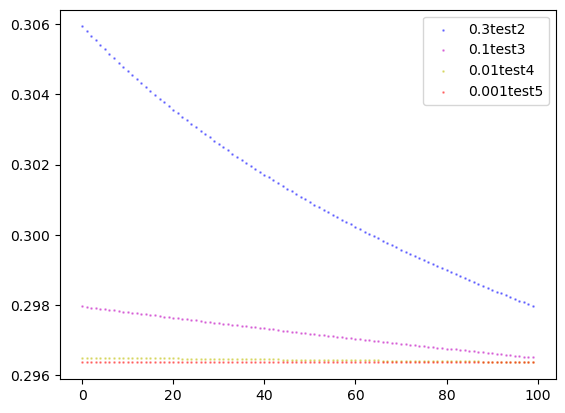


```python
ls2 = []
for i in range(iteration):
    ls2.append(i)
ter2 = np.array(ls2)
# 画曲线图
plt.plot(ter2, loss1_test, ls="-",color=colors1,marker =",", lw=2, label="learning_rate = 0.5-line")

plt.legend()
plt.show()
plt.plot(ter2, loss2_test, ls="-",color=colors2,marker =",", lw=2, label="learning_rate = 0.3-line")
plt.legend()
plt.show()
plt.plot(ter2, loss3_test, ls="-",color=colors3,marker =",", lw=2, label="learning_rate = 0.1-line")
plt.legend()
plt.show()
plt.plot(ter2, loss4_test, ls="-",color=colors4,marker =",", lw=2, label="learning_rate = 0.01-line")
plt.legend()
plt.show()
plt.plot(ter2, loss5_test, ls="-",color=colors5,marker =",", lw=2, label="learning_rate = 0.001-line")
plt.legend()
plt.show()
```


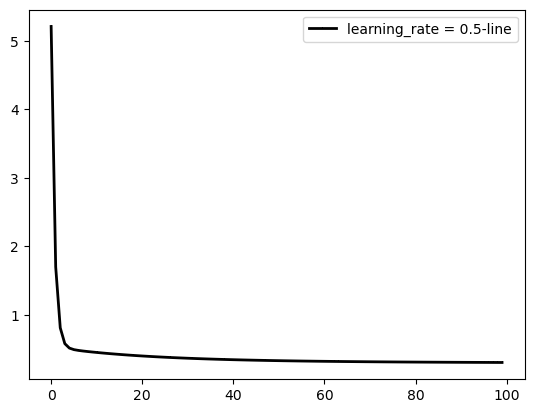


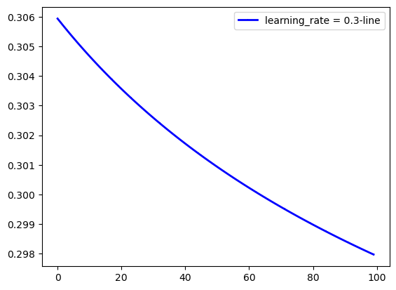


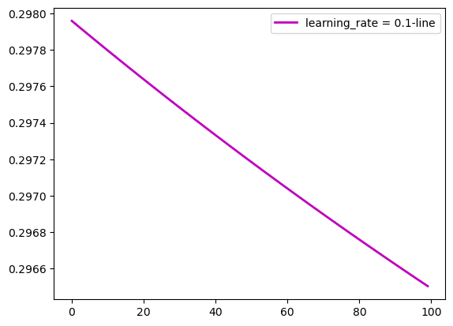


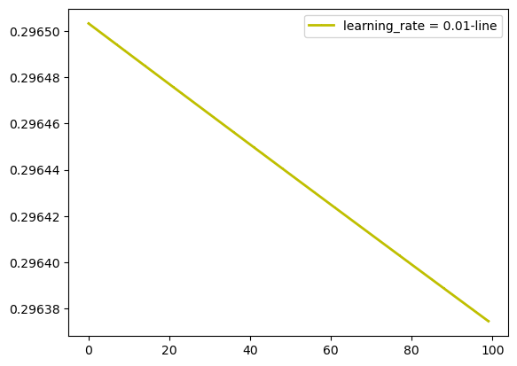


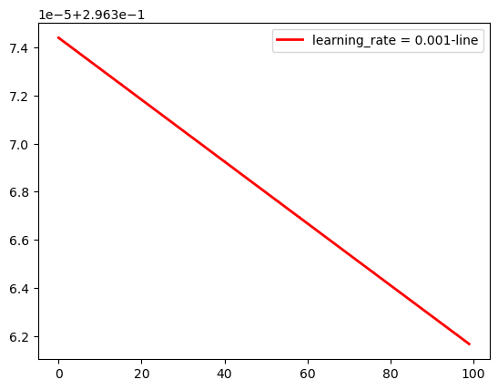


```python
# 测试循环
a = 10
while a > 0:
    print(a)
    a -= 1
    
# 测试参数
theta_test = theta1
print(theta_test.flatten())
```

    10
    9
    8
    7
    6
    5
    4
    3
    2
    1
    [ 5.87727811 -0.72648648 -1.34034374 -0.24082721 -0.26138857 -0.94648621
     -0.54943374  0.32925729  0.84869422  0.08818554  0.32170224  1.86830181]
    


```python
def random_down(x_train, y_train, x_test, y_test, learning_rate, theta):
    m = y_train.size
    train_history = np.zeros(500)
    test_history = np.zeros(500)
    t = theta.size
    iter_count = 0
    random_num = random.sample(range(0, m), 500)
    while max(theta) > 0.2 and iter_count < 500:
        # 随机取一个数据
        # random_num = random.sample(range(0, m), 1)
        # print(random_num[iter_count])
        mid = 0
        for j in range(t):
            mid += theta[j] * x_train[random_num[iter_count]][j]
        
        for j in range(t):
            theta[j] = theta[j] - learning_rate * ((mid - y_train[random_num[iter_count]]) * x_train[random_num[iter_count]][j])
        train_history[iter_count] = compute_cost(x_train, y_train, theta)
        test_history[iter_count] = compute_cost(x_test, y_test, theta)
        iter_count += 1
    return theta, train_history, test_history
```


```python
# 测试为什么只有一个值
theta1, loss1_train, loss1_test = random_down(x_train, y_train, x_test, y_test, 0.5, W_init)
```


```python
print(x_train[1881][4])
```

    -0.0750217003559737
    


```python
print('start test which learning rate is 0.5')
theta1, loss1_train, loss1_test = random_down(x_train, y_train, x_test, y_test, 0.5, W_init)
print(theta1)
print(loss1_train)
print(loss1_test)
print('-------------------------------------------------------------------------------------')
print('start test which learning rate is 0.3')
theta2, loss2_train, loss2_test = random_down(x_train, y_train, x_test, y_test, 0.3, W_init)
print(theta2)
print(loss2_train)
print(loss2_test)
print('-------------------------------------------------------------------------------------')
print('start test which learning rate is 0.1')
theta3, loss3_train, loss3_test = random_down(x_train, y_train, x_test, y_test, 0.1, W_init)
print(theta3)
print(loss3_train)
print(loss3_test)
print('-------------------------------------------------------------------------------------')
print('start test which learning rate is 0.01')
theta4, loss4_train, loss4_test = random_down(x_train, y_train, x_test, y_test, 0.01, W_init)
print(theta4)
print(loss4_train)
print(loss4_test)
print('-------------------------------------------------------------------------------------')
print('start test which learning rate is 0.001')
theta5, loss5_train, loss5_test = random_down(x_train, y_train, x_test, y_test, 0.001, W_init)
print(theta5)
print(loss5_train)
print(loss5_test)
```

    start test which learning rate is 0.5
    [[ 5.36271249e+00]
     [-1.53171704e+00]
     [-2.26178069e+00]
     [ 2.96433404e-01]
     [ 1.15613356e+00]
     [-1.59977216e-03]
     [ 3.92002136e-01]
     [ 2.25791779e-01]
     [ 8.42931703e-01]
     [ 3.70287359e-01]
     [ 2.16817554e-01]
     [ 2.11309565e+00]]
    [0.29664399 0.30206353 0.31041016 0.31894353 0.29354506 0.5340422
     0.3243632  0.92197242 0.69472115 0.44747276 0.36719037 0.29962479
     0.41991995 0.34433074 0.29576827 0.33284516 0.3287564  0.300207
     0.32876896 0.57395837 0.32553532 0.32806033 0.29259366 0.29732864
     0.29787858 0.29844902 0.51328261 0.38843163 0.85000178 0.36361648
     0.94528625 0.59266297 0.29919386 0.29138002 0.31374094 0.29193342
     0.29130547 0.60816652 0.46670106 0.33476228 0.69342793 0.31334168
     0.36732515 0.30719504 0.3561243  0.36820504 0.30412875 0.4769748
     0.52695535 0.73137186 0.61883714 0.38374148 0.62162041 0.3990994
     0.35784511 0.30817498 0.50366695 0.34022341 0.43284317 0.47777
     0.33054437 0.3200589  0.58315177 0.32026211 0.31393468 0.33914506
     0.43953567 0.40806542 0.39474605 0.3882803  0.51250399 0.32845044
     0.54500642 0.43101244 0.57272387 0.44724216 0.36339745 0.34069993
     0.33136242 0.36292267 0.32181832 0.37893154 0.33345085 0.31298031
     0.32544509 0.32527294 0.33193658 0.30663371 0.39575229 0.43387397
     0.31443243 0.30775282 0.31916005 0.45114346 0.33267386 0.32461603
     0.40686642 0.31071037 0.36449414 0.37230848 0.52100329 0.32875819
     0.49357903 0.85976187 0.47658836 0.30337382 0.46191979 0.30148927
     0.54403543 0.43499112 0.32405604 0.2960855  1.15596609 0.33378944
     0.29770584 0.29322126 0.30841104 0.42771893 0.29388818 0.56297076
     0.31043076 0.35355162 0.30673674 0.34483438 0.30970653 0.30906537
     0.35469931 0.37864383 0.43175001 0.53955316 0.45107243 0.33402649
     0.32880406 0.30208194 0.50986382 0.31678259 0.30396936 0.32763481
     0.42383386 0.42419293 0.30357402 0.3018123  0.340658   0.35973981
     0.31764928 0.37695155 0.30441039 0.36525915 0.3349507  0.30249249
     0.33026021 0.29684875 0.30033341 0.3216922  0.29870701 0.3431087
     0.29623866 0.29899183 0.30269277 0.30820474 0.29687824 0.42960833
     0.33663214 0.3254673  0.33005838 0.29988888 0.3098095  0.50006349
     0.32543847 0.29730566 0.35397272 0.30944055 0.29553403 0.61631539
     0.2963193  0.64259011 0.50415816 0.56550728 0.55901168 0.3623101
     0.32922666 0.29812908 0.30734315 0.32477665 0.3949512  0.3632583
     0.39432965 0.32443688 0.2993223  0.31627912 0.69492025 0.31989808
     0.31096952 0.30101525 0.2952145  0.30018864 0.32587371 0.30029062
     0.3615813  0.29833139 0.33175811 0.42357747 0.30341977 0.35344187
     0.3117033  0.34030451 0.29524392 0.29844422 0.34434321 0.46299838
     0.4444434  0.39417698 0.30208119 0.42950364 0.34078667 0.44239753
     0.36045112 0.6509393  0.65681897 0.43393973 0.35309638 0.36438085
     0.30258974 0.29974502 0.30209795 0.76901352 0.3346521  0.32259855
     0.32940842 0.30984976 0.40059831 0.3047291  0.47688689 0.57714086
     0.30716445 0.36863589 0.53457544 0.30272573 0.43238477 0.5023429
     0.31685354 0.3526805  0.30608812 0.59147979 0.63336989 0.42971199
     0.36604464 0.34194349 0.35177518 0.35212837 0.35303114 0.37989646
     0.37079064 0.60157305 0.56758183 0.64422711 0.3834536  0.43540383
     0.35757128 0.32366718 0.37589715 0.40010229 0.40546148 0.3825267
     0.29464566 0.29568552 0.33614981 0.57124557 0.44756585 0.45954021
     1.00258428 0.60633867 0.36952208 0.31135512 0.4865369  0.33185086
     0.31927284 0.89550185 1.03476834 0.70066817 0.52056917 0.31430586
     0.30393433 0.34586439 0.33621031 1.06682622 0.8603071  0.41329091
     0.53601051 0.45775841 0.33796564 0.30050964 0.30062974 1.30370271
     0.78730704 0.50475304 0.34317137 0.68926829 0.37606079 0.34193988
     0.30011778 0.41703702 0.31539849 0.36636059 0.48972781 0.78360118
     0.37233093 0.38211463 0.30058798 0.47231659 0.71158786 0.31120218
     0.32527882 0.38052584 0.30603604 0.48590704 0.34935185 1.68108784
     0.86021363 0.90554571 0.44272688 0.53116016 0.36994107 0.37664079
     0.38452722 0.44686676 0.34832567 0.68154494 0.55886074 0.3913014
     0.37133958 0.68034134 0.45537085 0.41344068 0.42573031 0.33413554
     0.31748728 0.37010004 0.44573568 0.31049325 0.39845224 0.33304774
     0.33566066 0.43634777 0.32242616 0.472556   0.34422401 0.30620872
     0.36649517 0.31355136 0.4555521  0.42036192 0.66031805 0.29589397
     0.41210499 0.64882413 0.29364076 0.51233366 0.36424197 0.60150837
     0.80311274 0.30366899 0.29583505 0.30351782 0.29921658 0.41667277
     0.4312974  0.33353635 0.40860186 0.30869249 0.2911917  0.28998244
     0.29129725 0.31335095 0.29444417 0.45183188 0.41488555 0.70279554
     0.36009026 0.60300446 0.29861954 0.31559447 0.56861068 0.31656674
     0.47826966 0.53476328 0.41688927 0.3624939  0.3186101  0.3347276
     0.29889604 0.35001662 0.31927229 0.40739982 0.40353301 0.32174141
     0.44000981 0.31347929 0.32685168 0.31496783 0.42492599 0.32782033
     0.33097076 0.32415614 0.32046804 0.33403633 0.3297535  0.42612294
     0.53903305 0.61402694 0.44444818 0.31599522 0.29995698 0.30394241
     0.30406959 0.40047161 0.39081603 0.35104255 0.3047399  0.2963228
     0.31463345 1.7400853  0.63995632 0.30368986 0.29769596 0.30523404
     0.43504653 0.30971525 0.30358997 0.29769122 0.29433227 0.30656808
     0.78143369 0.36020829 0.33514547 0.3043537  1.24729484 0.3011298
     0.46918246 0.34508261 0.30600435 0.32440021 0.2991087  0.31290553
     0.32133059 0.4219955  0.30674694 0.55767238 0.29544469 0.52650551
     0.31403403 0.29551445 0.3197631  0.29903865 0.31556203 0.29657041
     0.41702272 0.29770768 0.29694344 0.48348334 0.29620798 0.47151317
     0.35048619 0.34802443 0.37781466 0.37434631 0.31014644 0.42663443
     0.29112417 0.31139917 0.55178267 0.30651835 0.39000003 0.413919
     0.29312403 0.34327044 0.29599985 0.30041105 0.34365515 0.32889003
     0.31464742 0.31676345 0.29752833 0.29858805 0.37219117 0.29340819
     0.30716245 0.32639421 0.29769266 0.36067683 0.29484794 0.40850797
     0.58665011 1.26851878 0.99010312 0.68812776 0.37319902 0.46270001
     0.39475171 0.42436695]
    [0.2945645  0.2999811  0.30837016 0.31690257 0.29219278 0.53310385
     0.32382071 0.92241445 0.69436368 0.44645133 0.36588968 0.29793407
     0.41911225 0.34332392 0.29431468 0.33053879 0.32807938 0.29781112
     0.32595672 0.57083285 0.32382457 0.32634253 0.29143112 0.29649784
     0.29705479 0.29746483 0.51089847 0.38691162 0.85184634 0.36434836
     0.94559019 0.59343113 0.29980525 0.29226812 0.31458908 0.29284911
     0.29227591 0.60797646 0.46648034 0.33496534 0.69252721 0.31360077
     0.36812616 0.30741979 0.35579335 0.37019092 0.30506083 0.47554402
     0.52526313 0.72901536 0.61693005 0.38353934 0.62031325 0.39960953
     0.36154511 0.31012989 0.51017197 0.34414745 0.43879081 0.48442769
     0.33451203 0.32163848 0.59205158 0.32592188 0.31903692 0.34558126
     0.44786213 0.41585919 0.40223294 0.38953323 0.51213175 0.33161647
     0.55515852 0.44008385 0.58334402 0.45644671 0.37124428 0.34556724
     0.33895377 0.37114284 0.32630544 0.38400773 0.33831234 0.31766951
     0.32982621 0.33047029 0.33717149 0.31123304 0.39916715 0.43702662
     0.31848626 0.31194642 0.32373666 0.45578146 0.33707294 0.32803117
     0.41066973 0.31360587 0.36728533 0.37506295 0.5230778  0.3314758
     0.49485442 0.85955774 0.4779403  0.30611043 0.46245817 0.30431623
     0.54470618 0.4363083  0.32654643 0.29913757 1.15167848 0.33529471
     0.30190968 0.29692661 0.31330901 0.43586737 0.29736625 0.57552428
     0.31611315 0.35378766 0.31216927 0.34626735 0.31501485 0.31153346
     0.35554688 0.3787869  0.43075504 0.537083   0.45027567 0.33600775
     0.33096791 0.30697625 0.50772148 0.32399543 0.31016631 0.3352495
     0.4345798  0.43494686 0.30967294 0.30569306 0.34858643 0.36126256
     0.32092325 0.3785904  0.3114152  0.37466634 0.34341111 0.30935849
     0.33845863 0.30172186 0.30692693 0.32957745 0.30530814 0.35219948
     0.30264571 0.30600653 0.30815633 0.31335057 0.3030334  0.44134812
     0.34586178 0.33023292 0.33863986 0.30630335 0.31479342 0.50050254
     0.32846456 0.30188527 0.35626324 0.31501263 0.29966077 0.61593801
     0.29952482 0.6513274  0.51200513 0.57396357 0.56740878 0.36781175
     0.33394719 0.30147572 0.31124521 0.32916251 0.40104233 0.36879258
     0.40037097 0.32935488 0.30323534 0.31873336 0.69322405 0.3218121
     0.31307938 0.30487029 0.29853685 0.30303606 0.33032042 0.3033087
     0.36671015 0.30153034 0.33609057 0.42890007 0.30623716 0.35775359
     0.31337477 0.34409403 0.2980204  0.30134533 0.34574782 0.4631198
     0.44477107 0.39494739 0.30521205 0.4338743  0.344223   0.44372946
     0.36268506 0.65154483 0.65738292 0.43540874 0.3608169  0.36625924
     0.30691571 0.30352561 0.3064722  0.76202194 0.33495724 0.32341271
     0.33427802 0.31075517 0.3983385  0.30759999 0.4729067  0.58949899
     0.30960115 0.36855972 0.53068517 0.30493271 0.43126332 0.50037439
     0.31879995 0.35358911 0.31048034 0.60167089 0.62944062 0.42893902
     0.3757051  0.35082882 0.35354055 0.36085521 0.36178708 0.3814124
     0.37255476 0.59795214 0.56453578 0.63997734 0.38345901 0.44610428
     0.36628372 0.3261893  0.37671167 0.4005007  0.4057516  0.38329009
     0.29869516 0.29935735 0.34277239 0.58162934 0.45666911 0.45963947
     1.01887612 0.61929812 0.37975552 0.31933918 0.48716211 0.33595213
     0.32396342 0.89085547 1.02912474 0.69754971 0.5195904  0.32079857
     0.30992876 0.35349469 0.34354931 1.08139459 0.87372281 0.42206208
     0.54651255 0.46026261 0.34232568 0.30606591 0.30617569 1.29836416
     0.78592424 0.50542955 0.35181413 0.70451002 0.38630758 0.35131034
     0.3060361  0.4185439  0.32013026 0.37568276 0.50036911 0.79667753
     0.3810595  0.39104516 0.30498864 0.48283663 0.72482996 0.3176927
     0.33479403 0.39136194 0.31345337 0.50015695 0.36054692 1.70684887
     0.88005678 0.92582427 0.45734751 0.54760385 0.38259189 0.38950307
     0.39762343 0.45484068 0.35914862 0.6994776  0.57448058 0.40519535
     0.38466092 0.69689528 0.4632771  0.42150022 0.43920775 0.34595115
     0.32881994 0.3826215  0.45924727 0.32092745 0.40446091 0.34018868
     0.34616766 0.44852146 0.33301188 0.4856     0.35560213 0.3145086
     0.37732969 0.32018702 0.46007309 0.42532491 0.6624904  0.30182645
     0.41640848 0.65074044 0.30009839 0.51400549 0.37316702 0.61165809
     0.81464537 0.31176516 0.30270991 0.31005076 0.30699816 0.42588415
     0.44066315 0.3416781  0.41752711 0.31572546 0.29740213 0.29599304
     0.29697428 0.32035133 0.30090624 0.45474013 0.41803002 0.70378452
     0.36359329 0.60515186 0.30195086 0.3186085  0.56902043 0.31850732
     0.47793155 0.53402243 0.41693984 0.3630882  0.3224556  0.33896867
     0.30117355 0.35045638 0.32249358 0.41224751 0.40259487 0.32256538
     0.43870714 0.31464266 0.32758833 0.31731992 0.42908429 0.33026668
     0.33351556 0.32658028 0.32278882 0.33506467 0.33087289 0.43004413
     0.54404178 0.61944217 0.4490262  0.31866399 0.3020176  0.3063672
     0.30650026 0.40513318 0.39536793 0.35508635 0.30642286 0.29892183
     0.3182368  1.75134253 0.64652048 0.30573726 0.29811687 0.30765946
     0.43985361 0.31153706 0.30335994 0.29917797 0.29545832 0.30835584
     0.78788811 0.3626235  0.3370551  0.3041784  1.24327109 0.30494243
     0.47629996 0.34969549 0.3094066  0.32455731 0.30207868 0.31401571
     0.32540425 0.42268509 0.31033021 0.55601493 0.29755322 0.53273677
     0.31580132 0.29830482 0.32074003 0.30207443 0.31661777 0.29865744
     0.41646799 0.2996153  0.29962698 0.48288147 0.29895448 0.4768933
     0.35089104 0.35129313 0.38136719 0.37786314 0.31068784 0.42548376
     0.29234734 0.31413782 0.55879276 0.30971531 0.3894363  0.41314171
     0.29497132 0.34655601 0.29783915 0.30255208 0.34696881 0.33197578
     0.31738012 0.31664996 0.29822971 0.30067462 0.37075971 0.294561
     0.30755254 0.32627579 0.29863748 0.36368097 0.29603302 0.4118152
     0.59147668 1.280744   1.00065267 0.69644012 0.37738714 0.46826038
     0.39911801 0.42930019]
    -------------------------------------------------------------------------------------
    start test which learning rate is 0.3
    [[ 5.96537362]
     [-1.34011214]
     [-2.10792715]
     [ 0.21127283]
     [ 1.02659428]
     [-0.19461289]
     [ 1.04417305]
     [ 0.26296455]
     [ 0.64737732]
     [ 0.2017302 ]
     [ 0.16302165]
     [ 2.42611783]]
    [0.48624544 0.36972145 0.34576146 0.29117561 0.35955336 0.29136463
     0.34317662 0.3446481  0.38155461 0.32082959 0.3884486  0.30232799
     0.29283831 0.32483921 0.33571718 0.30034488 0.31370936 0.30898737
     0.30463644 0.30583863 0.31415953 0.29859751 0.29162864 0.29115427
     0.29094059 0.30325735 0.42324151 0.37341353 0.40354593 0.3668946
     0.29283152 0.29829482 0.2938557  0.29373743 0.32543832 0.29298167
     0.3351523  0.30779714 0.29671247 0.29281195 0.31623902 0.30893075
     0.30608875 0.29477095 0.32053625 0.29102783 0.29398217 0.38895823
     0.31466563 0.29207917 0.29707568 0.34642632 0.40053154 0.29834234
     0.30051149 0.32663234 0.29045359 0.2907453  0.32506878 0.33280286
     0.34898946 0.30991324 0.31050273 0.29592185 0.29207518 0.29378696
     0.29198104 0.466206   0.3050348  0.29303111 0.29294921 0.29040448
     0.31279848 0.29436591 0.29070685 0.33192271 0.29063977 0.29045821
     0.2898228  0.30569568 0.28886224 0.28968089 0.29690748 0.30181814
     0.28912632 0.33223796 0.29600845 0.29054606 0.29210085 0.29309964
     0.2909239  0.29456046 0.29867814 0.2907124  0.29044335 0.31812965
     0.28962601 0.30482938 0.29611916 0.29080705 0.30241458 0.28989269
     0.29233523 0.38365948 0.28995938 0.30878616 0.28907705 0.30529297
     0.72472535 0.64169055 0.35129236 0.34131571 0.64485374 0.42787365
     0.54411724 0.46159056 0.38144859 0.31834874 0.31522425 0.89108333
     0.69388213 0.4367973  0.32348797 0.32164149 0.30142174 0.29996942
     0.29564912 0.30831665 0.32919731 0.42568746 0.35066212 0.31972615
     0.29885482 0.32559876 0.3786487  0.30088506 0.30853178 0.30129676
     0.34862761 0.34953409 0.40018984 0.29791269 0.29755435 0.45384316
     0.35796607 0.46004865 0.46610185 0.44224825 0.35417055 0.3624823
     0.33624969 0.35796957 0.35626512 0.30051422 0.3363933  0.30259448
     0.39852517 0.37687252 0.39827338 0.38846027 0.31619515 0.31728151
     0.31116969 0.32055185 0.30955083 0.30002369 0.33255139 0.29958061
     0.30501606 0.29963749 0.30052846 0.34502882 0.30107288 0.30819701
     0.30886722 0.32246622 0.30683534 0.30287016 0.30878892 0.37284267
     0.30365069 0.34903844 0.30033901 0.32055022 0.37851575 0.30476361
     0.30826822 0.31232125 0.34935955 0.298304   0.29965174 0.31145373
     0.31851344 0.29796698 0.3231708  0.32777113 0.39947318 0.29935418
     0.2971243  0.37475157 0.38460928 0.35456879 0.32034622 0.45234463
     0.35495341 0.4688095  0.37613956 0.37937367 0.37812789 0.32911667
     0.312744   0.34975187 0.44613044 0.38855461 0.30008622 0.29874961
     0.30198108 0.33720113 0.3041716  0.36691794 0.38721155 0.30678581
     0.29274824 0.32621687 0.29170983 0.33810683 0.39233362 0.75132963
     0.9146973  0.44051319 0.4414591  0.3176092  0.35337937 0.29144228
     0.30340702 0.35612996 0.30714194 0.319097   0.30163286 0.29341718
     0.3053697  0.31507575 0.35030412 0.31365913 0.29438677 0.3345973
     0.29746244 0.29358044 0.29477034 0.29379232 0.29765288 0.29879203
     0.31275857 0.40639663 0.30787389 0.30441581 0.29788578 0.32510651
     0.30240038 0.29963136 0.29480383 0.31822966 0.3333668  0.30295828
     0.29629704 0.29585609 0.29870754 0.3953015  0.38098741 0.47922847
     0.40766866 0.29914695 0.29915306 0.30910406 0.33537514 0.29856931
     0.2969333  0.29549345 0.30329866 0.3001272  0.42470385 0.45988663
     0.37950325 0.44049508 0.32397313 0.3803049  0.31113623 0.32042948
     0.36355659 0.48841635 0.38171557 0.30758519 0.30179819 0.29174641
     0.29407512 0.35713286 0.41384357 0.3671061  0.29595294 0.35977371
     0.29268558 0.29305381 0.29304782 0.30203298 0.29694752 0.29815594
     0.3368666  0.37369027 0.31781761 0.30053104 0.29449636 0.32937811
     0.2932189  0.33278899 0.34408488 0.29355643 0.3439897  0.301726
     0.36253061 0.29005414 0.29560724 0.298057   0.34344181 0.29088172
     0.29115857 0.39648048 0.33585937 0.29018051 0.28923905 0.29055499
     0.29936642 0.30691843 0.45795352 0.41724885 0.46270189 0.39452678
     0.39575958 0.31500667 0.29481321 0.3376169  0.35169892 0.29543614
     0.3000094  0.30654883 0.29623363 0.2980857  0.29310155 0.32357139
     0.32256953 0.35563304 0.29380211 0.32514357 0.3115157  0.28995578
     0.34093945 0.2980566  0.29256174 0.3118616  0.29819496 0.30235288
     0.29425994 0.31503593 0.70411561 0.41205001 0.46379494 0.3515326
     0.57457292 0.3017917  0.29333851 0.31550811 0.29991104 0.34898863
     0.34332751 0.51177666 0.33395489 0.36475991 0.38280856 0.29599847
     0.3750174  0.30739776 0.29701139 0.34150087 0.36750852 0.44490759
     0.32009211 0.47166909 0.32231005 0.29983248 0.49350369 0.41297733
     0.33143434 0.4156262  0.36735512 0.39933365 0.31408962 0.3117179
     0.46823623 0.50082003 0.38013981 0.30896605 0.33838969 0.30473766
     0.34906973 0.37500055 0.30141434 0.30147672 0.34599651 0.30980424
     0.32457851 0.34639964 0.46332892 0.3770018  0.36858375 0.42987892
     0.34677799 0.40218424 0.40813688 0.31803475 0.32144383 0.30389699
     0.30493666 0.35542281 0.31433848 0.30081921 0.29995412 0.31408848
     0.2969512  0.3086505  0.31731384 0.29869622 0.34234141 0.39201276
     0.31195207 0.41603898 0.42419879 0.33491731 0.40637755 0.34268387
     0.32740301 0.35860174 0.30442959 0.30519246 0.29799829 0.2969603
     0.29731075 0.29888604 0.29803553 0.30077246 0.3741451  0.34685239
     0.30494768 0.31726776 0.29813106 0.32260718 0.30904578 0.30057636
     0.32866289 0.32502431 0.31515144 0.30022167 0.30262306 0.35701887
     0.30783232 0.30755193 0.29947563 0.30261269 0.32010679 0.30239171
     0.29904953 0.29856071 0.29842757 0.30146575 0.30554548 0.30029787
     0.3115683  0.31030053 0.33061878 0.30942541 0.50806092 0.44842369
     0.53996434 0.29617553 0.54517268 0.35056292 0.29895879 0.36359277
     0.29494201 0.35554    0.37611629 0.54905985 0.46731781 0.3156362
     0.28839404 0.30959643 0.31126993 0.29003682 0.29231261 0.29253508
     0.3129204  0.29254112]
    [0.49194085 0.37361724 0.34906429 0.29197065 0.35715546 0.29132011
     0.34066501 0.34209415 0.37794774 0.31897071 0.39272701 0.30425188
     0.2936389  0.3235587  0.33412299 0.30007872 0.31658794 0.31170488
     0.30720545 0.30846726 0.31713534 0.2990438  0.29336669 0.29277941
     0.29220249 0.30355757 0.42081296 0.37176412 0.40132893 0.36540808
     0.29411738 0.30106893 0.2963072  0.29489513 0.33042235 0.29568741
     0.33430337 0.3082631  0.29794187 0.29436454 0.31612407 0.3091556
     0.30645342 0.29589984 0.32045647 0.29267191 0.29520964 0.38688757
     0.31460718 0.29365611 0.29818752 0.34598963 0.39933276 0.29987747
     0.30343804 0.33043871 0.29230388 0.29278545 0.32863241 0.33651765
     0.35307881 0.31289655 0.31103857 0.29703071 0.29386159 0.29518216
     0.29394052 0.46439026 0.30556659 0.29505403 0.29496776 0.29183492
     0.31341403 0.29570965 0.29272162 0.33516168 0.29279683 0.29260089
     0.29149683 0.30802137 0.29038982 0.29137183 0.29899624 0.30244479
     0.29047072 0.33540609 0.29835782 0.29259808 0.2936016  0.29513828
     0.29213616 0.29627736 0.30051402 0.29218544 0.29144098 0.31828551
     0.29083373 0.30663522 0.29738427 0.2926921  0.30343872 0.29170262
     0.29396839 0.38437072 0.29215413 0.31220088 0.29204402 0.30885249
     0.72973585 0.6461252  0.35371836 0.34361194 0.64904921 0.43098854
     0.54788573 0.4649315  0.38421662 0.32049153 0.3172951  0.89756236
     0.69993931 0.44179991 0.32821221 0.32485979 0.30503958 0.30363609
     0.29967902 0.31204837 0.33451991 0.43121605 0.35571283 0.32441245
     0.30293778 0.32930882 0.38209121 0.30463559 0.31208766 0.30538735
     0.35304192 0.35395205 0.40496445 0.30142859 0.301048   0.45915561
     0.36295297 0.46529671 0.47136388 0.44742119 0.35879362 0.36719261
     0.34085088 0.36282431 0.3611053  0.30411421 0.33875125 0.30568703
     0.40244125 0.38064428 0.40222742 0.39233153 0.31909483 0.32020355
     0.31393952 0.32183357 0.31112557 0.30207537 0.33550214 0.30217714
     0.30770712 0.30208437 0.30284328 0.34614011 0.30290471 0.30986358
     0.31051669 0.323991   0.30864995 0.30478363 0.31061163 0.3741482
     0.30586525 0.35080921 0.30298133 0.32372481 0.38215544 0.30799514
     0.31155813 0.31566428 0.35287066 0.30097834 0.30264133 0.31475909
     0.32059682 0.3004073  0.32628533 0.33095073 0.40322616 0.3021249
     0.29967341 0.37842819 0.38834902 0.3581407  0.32352931 0.45686108
     0.35904143 0.47361192 0.3805163  0.38374954 0.38249664 0.33310792
     0.31641569 0.35230543 0.44781163 0.39021457 0.30163312 0.30043928
     0.30394474 0.33997705 0.30629532 0.37064233 0.39100077 0.3092723
     0.29474749 0.32741052 0.29407902 0.33932319 0.39285762 0.74987288
     0.91259144 0.44125154 0.44219091 0.31917773 0.35432341 0.29293275
     0.30561984 0.3574895  0.30897153 0.32073004 0.30367142 0.29607431
     0.3082411  0.31596244 0.3505103  0.316434   0.29665207 0.33526027
     0.29923313 0.29502213 0.29636318 0.29529015 0.29880226 0.30052027
     0.31485501 0.40489003 0.30752029 0.30420241 0.29912698 0.3272005
     0.30394623 0.29991575 0.29526684 0.31996599 0.33542657 0.30243613
     0.2962839  0.29605126 0.29922564 0.39815774 0.38366375 0.48291811
     0.41063628 0.29967977 0.29968546 0.30921534 0.33484687 0.299626
     0.29813704 0.29708341 0.305584   0.30221387 0.42167378 0.45625767
     0.38494295 0.44766676 0.32205069 0.37648506 0.30975671 0.31855082
     0.35989636 0.48196748 0.3774317  0.30607041 0.30074489 0.29176222
     0.29531847 0.36176354 0.41998115 0.37186882 0.29796153 0.36440242
     0.29332823 0.2935738  0.29434938 0.30165397 0.29709401 0.30061035
     0.3411116  0.37909855 0.31773467 0.30123487 0.29704202 0.33389048
     0.29439837 0.3324742  0.34347139 0.29462345 0.34303946 0.30204673
     0.36112085 0.29133458 0.29797288 0.30059863 0.34207007 0.29203754
     0.29296546 0.40199095 0.34018519 0.29149791 0.29123992 0.29170991
     0.30213156 0.31005752 0.46353347 0.42225694 0.46825951 0.3992287
     0.40048303 0.317812   0.29507354 0.34042117 0.35476015 0.29696952
     0.30179842 0.30863314 0.29596456 0.29924911 0.29385716 0.32584629
     0.32481718 0.35846402 0.29460036 0.32731141 0.31335311 0.29045326
     0.33919427 0.29786897 0.29307304 0.31381762 0.29773078 0.30356529
     0.29404588 0.31383889 0.69726533 0.40974539 0.46073967 0.35031313
     0.5689894  0.30127217 0.29361966 0.31421932 0.3011215  0.3518056
     0.34599737 0.51729545 0.33693774 0.36844638 0.3868746  0.29624179
     0.37225048 0.3065457  0.29727397 0.34417957 0.36493486 0.44121133
     0.31867824 0.46860972 0.32084742 0.29959195 0.49731174 0.41617031
     0.33324208 0.41853662 0.36960815 0.40192474 0.31503959 0.31260067
     0.46544849 0.49781723 0.37828087 0.3080834  0.33944095 0.30388228
     0.34720879 0.37293193 0.30065246 0.30058328 0.3440778  0.30857319
     0.32309437 0.34706982 0.46512534 0.37821702 0.36972278 0.43163471
     0.34801616 0.40407693 0.41004668 0.31775058 0.32108948 0.3042265
     0.30516052 0.35490517 0.31418487 0.30134874 0.30044562 0.31355221
     0.29714153 0.30944184 0.31828417 0.29908142 0.34368781 0.39356631
     0.31310721 0.41799002 0.42616092 0.33618075 0.40539874 0.34192567
     0.32692396 0.35768438 0.30443356 0.30517036 0.29836933 0.29746617
     0.29796543 0.29911941 0.29834607 0.3008921  0.3735053  0.34639604
     0.30526272 0.31727172 0.29891552 0.32243305 0.3090508  0.30150242
     0.32871333 0.32512431 0.3159701  0.30072069 0.30331456 0.3583767
     0.30851828 0.3079553  0.30022683 0.3036195  0.31988175 0.30296165
     0.29948519 0.29896249 0.29882455 0.30153207 0.30551306 0.30107301
     0.31243156 0.31114062 0.33174999 0.31026114 0.50692799 0.44762485
     0.53865507 0.29771482 0.54254231 0.35032569 0.29983329 0.36268889
     0.29606327 0.35563032 0.37590006 0.5469759  0.46596758 0.31645997
     0.29037938 0.31270395 0.31142916 0.29135812 0.29333943 0.29470896
     0.31273135 0.29327048]
    -------------------------------------------------------------------------------------
    start test which learning rate is 0.1
    [[ 5.98721015]
     [-1.17364664]
     [-2.26748092]
     [ 0.23565764]
     [ 1.28452918]
     [-0.20521789]
     [ 1.09883628]
     [ 0.35197247]
     [ 0.76652471]
     [-0.07235635]
     [ 0.07333709]
     [ 2.15934858]]
    [0.29436765 0.29276939 0.29755787 0.29507815 0.28907194 0.28858105
     0.28856303 0.28911177 0.28860703 0.28882755 0.28855662 0.28857265
     0.29747113 0.2888938  0.31587394 0.34330499 0.34523128 0.35971477
     0.32195263 0.32074475 0.30228137 0.32594287 0.31471762 0.29806527
     0.30012704 0.30502713 0.31318301 0.30161396 0.3375357  0.30447262
     0.32589165 0.32415607 0.31017663 0.31329019 0.30472702 0.30852427
     0.32561618 0.31215357 0.30229916 0.36128939 0.37494446 0.34879246
     0.35696267 0.3315694  0.30620354 0.29524503 0.28835928 0.29469735
     0.28808347 0.28816639 0.2896503  0.29155786 0.29116305 0.30350051
     0.29366367 0.29079347 0.29603765 0.28931406 0.28797515 0.29098875
     0.30533362 0.31289478 0.29940256 0.29624702 0.28864623 0.28782114
     0.3215719  0.32609863 0.32453866 0.31651715 0.30698241 0.30773799
     0.29280928 0.29216596 0.29198265 0.29675798 0.31341425 0.29166824
     0.28826807 0.28846431 0.28834943 0.29051229 0.29064811 0.29082218
     0.2877245  0.28887246 0.28793969 0.28800442 0.28831248 0.28948022
     0.29124876 0.29345122 0.28917545 0.29428705 0.29714165 0.2890929
     0.28805631 0.28790518 0.29224317 0.29015304 0.28771317 0.28846233
     0.28921077 0.29239885 0.29979965 0.2954221  0.30450158 0.29803015
     0.28842962 0.29897964 0.30708783 0.33384965 0.3165605  0.34039677
     0.32641122 0.31713388 0.32421878 0.32365361 0.32840139 0.32494582
     0.30533316 0.3005885  0.28964386 0.2903441  0.29373577 0.32213797
     0.30629516 0.31724548 0.31280719 0.31793282 0.31640624 0.31203245
     0.31121639 0.33375488 0.31345292 0.29049694 0.29013993 0.28822298
     0.29103707 0.30267591 0.29873665 0.28751102 0.28829863 0.29049114
     0.2962679  0.28795724 0.28902304 0.299432   0.29224917 0.29005534
     0.28862817 0.2910959  0.28819676 0.28760899 0.28861212 0.30267008
     0.28769696 0.2961644  0.28830026 0.29165183 0.28932003 0.2998538
     0.30674397 0.35576588 0.34550853 0.32783256 0.30485162 0.2997661
     0.28841638 0.2879554  0.29350589 0.29340582 0.29006532 0.29078137
     0.2909502  0.28861155 0.28823895 0.28938777 0.29209592 0.29888561
     0.29221402 0.29053554 0.28981627 0.28956902 0.29080257 0.29007125
     0.28966724 0.28942099 0.29266697 0.28910675 0.28983783 0.29125008
     0.29181916 0.29896369 0.30268138 0.30112425 0.29561588 0.29119383
     0.30992699 0.31635642 0.31598342 0.31911489 0.32126746 0.31280658
     0.3045512  0.32330268 0.30681889 0.29880686 0.293541   0.31172755
     0.30631036 0.32199855 0.30348166 0.33650869 0.32518708 0.3374638
     0.34144922 0.33184272 0.32326839 0.31044889 0.30301061 0.3080928
     0.30242587 0.29977794 0.30157533 0.31106892 0.31763401 0.29466026
     0.29260411 0.29127895 0.29814936 0.29413371 0.29175901 0.29644964
     0.30009874 0.28980339 0.29242921 0.29932072 0.2959415  0.3001604
     0.29348133 0.29391709 0.2901158  0.29119852 0.29062656 0.29151172
     0.29828862 0.28997993 0.29876329 0.30090167 0.30298367 0.30186244
     0.29379007 0.29043193 0.29085083 0.2928654  0.29244079 0.30030209
     0.33291217 0.34389643 0.31668537 0.36226139 0.34795695 0.34358044
     0.33512802 0.32272678 0.32648402 0.34741853 0.31242355 0.29130617
     0.29009907 0.29009022 0.29255807 0.29408325 0.29006496 0.29454104
     0.29554575 0.31782421 0.31282548 0.33931626 0.30955714 0.30201925
     0.29419836 0.29407411 0.29224334 0.3026518  0.32159979 0.30764474
     0.29300073 0.29452837 0.30293139 0.29242849 0.29265058 0.29301499
     0.2957109  0.29449558 0.29166899 0.29259694 0.29683222 0.29323743
     0.29820509 0.30807067 0.31607493 0.30881609 0.29196235 0.2917522
     0.30139544 0.29729602 0.31184281 0.31047825 0.30790303 0.31045589
     0.30421951 0.29929829 0.30859614 0.30403312 0.29297596 0.2923173
     0.29310916 0.29414452 0.30024473 0.29538423 0.29099093 0.29145775
     0.29619515 0.30154006 0.29801327 0.309613   0.30052599 0.29277375
     0.30555913 0.30015386 0.30196911 0.2935049  0.30572436 0.29192524
     0.2949542  0.29625036 0.29553104 0.29413106 0.29170039 0.29174047
     0.29172554 0.29173043 0.29242744 0.29355563 0.29593902 0.30231861
     0.30439535 0.32006972 0.30627315 0.33828384 0.33908536 0.34779234
     0.32585094 0.32578514 0.31127449 0.30584812 0.29426614 0.29577297
     0.29982146 0.29252766 0.29303439 0.29272107 0.30037909 0.29366661
     0.29536067 0.29642171 0.29471555 0.2942408  0.29776232 0.29280265
     0.29416941 0.31600993 0.29272048 0.29385241 0.29340893 0.30109492
     0.29281084 0.29698832 0.29359552 0.29262219 0.298542   0.30234026
     0.29705307 0.3070571  0.29235231 0.29911042 0.30362693 0.32493021
     0.30023811 0.31516552 0.29680175 0.29907177 0.2978868  0.30178395
     0.30494105 0.31186145 0.31199315 0.3036168  0.30513761 0.30376153
     0.29740248 0.29162224 0.29256324 0.29411507 0.29935125 0.29552674
     0.29173051 0.29160584 0.29174824 0.30090233 0.30877002 0.30353384
     0.32018841 0.31546092 0.29771942 0.30229119 0.29672709 0.29233603
     0.29062933 0.29063532 0.29086174 0.31478992 0.29407331 0.29358866
     0.2921073  0.29798127 0.29597162 0.3394252  0.3495966  0.33891354
     0.3304356  0.3461911  0.32664422 0.32723556 0.34091118 0.3474825
     0.33493631 0.30439686 0.30365936 0.31719524 0.29520487 0.29286973
     0.29262836 0.29227602 0.29668181 0.29415242 0.29303245 0.30260528
     0.29582194 0.29527088 0.29399851 0.29408234 0.29366903 0.29473741
     0.33356656 0.31173345 0.29732319 0.29389418 0.29171045 0.30000932
     0.29603735 0.29479592 0.30393132 0.3296892  0.3376209  0.31321341
     0.31795658 0.30789358 0.31593359 0.31755553 0.31432953 0.30402752
     0.30072539 0.30249493 0.3144967  0.30211173 0.30251636 0.31505159
     0.35266307 0.3466157  0.31557839 0.31517719 0.2966789  0.30978341
     0.30533984 0.31933322 0.33171871 0.3537416  0.34159064 0.33394875
     0.33071471 0.30673856 0.29915859 0.30000053 0.29928452 0.30122128
     0.30009163 0.29678464]
    [0.29497068 0.29344669 0.29799646 0.29564485 0.29016045 0.28984123
     0.28985158 0.29061046 0.28995189 0.2902805  0.28984068 0.28990224
     0.29962062 0.29007987 0.31560954 0.34232377 0.34421746 0.35839893
     0.32147602 0.32030411 0.3024942  0.32545813 0.31454628 0.29839637
     0.30034299 0.30501308 0.31288135 0.30180889 0.33665618 0.30467284
     0.32537842 0.3236894  0.31008588 0.31312172 0.30479452 0.30844713
     0.32507271 0.31207014 0.30259908 0.35998736 0.37339093 0.34756082
     0.35558253 0.33077363 0.30618725 0.29576316 0.28967028 0.29523779
     0.28964345 0.28944972 0.29134239 0.29241907 0.29205697 0.30370176
     0.29440522 0.29175687 0.29870544 0.29092842 0.28979244 0.29348957
     0.30867025 0.31649959 0.30243833 0.2991117  0.29091682 0.28983111
     0.32218962 0.32663937 0.32510994 0.3173056  0.30806197 0.30878729
     0.29435026 0.29374574 0.29357453 0.29804903 0.31414444 0.29325611
     0.29021213 0.2903624  0.29074156 0.29312642 0.29327254 0.29346052
     0.28980758 0.29076401 0.29022407 0.28998621 0.29059604 0.29193138
     0.29385867 0.29622093 0.29166822 0.29718731 0.30019897 0.29154128
     0.29026543 0.2900259  0.29501395 0.29276774 0.28981967 0.29029974
     0.29165903 0.29512333 0.30290884 0.29836942 0.30775212 0.30100052
     0.29086603 0.30221045 0.31056489 0.33798286 0.32040051 0.34481299
     0.33056245 0.32109347 0.32837399 0.32779551 0.33266826 0.32912351
     0.30889925 0.30400373 0.29244915 0.29322224 0.29685641 0.32609233
     0.30976425 0.32103489 0.31647723 0.32177615 0.32020866 0.31572913
     0.31488642 0.33804738 0.31716918 0.29316528 0.29277768 0.29057654
     0.29369256 0.30604936 0.30195349 0.28957715 0.29061016 0.29303693
     0.2991825  0.29013682 0.29139396 0.3023666  0.29476998 0.29239576
     0.29078924 0.29237019 0.28973876 0.28929657 0.2900768  0.30333679
     0.28962092 0.29899596 0.29049362 0.29416505 0.29167955 0.30289943
     0.31005663 0.36047827 0.35000835 0.33193507 0.30834993 0.30308458
     0.29085251 0.29006691 0.29485608 0.29476307 0.29269973 0.29349549
     0.29367939 0.29100683 0.29046884 0.29196058 0.29391854 0.30040471
     0.2942273  0.29274349 0.29214287 0.29195323 0.29388468 0.29304561
     0.29218365 0.29214111 0.2959491  0.29161814 0.29271222 0.29330195
     0.29380019 0.3028301  0.30673794 0.30509288 0.29926755 0.29442335
     0.31447409 0.32116632 0.32077947 0.32401195 0.32623737 0.31751327
     0.30890644 0.32825506 0.31121929 0.30286992 0.29719463 0.31642229
     0.31079749 0.32720697 0.30793812 0.34193089 0.33031118 0.34295965
     0.3470561  0.33716752 0.32831133 0.31508295 0.30731327 0.31264057
     0.30670288 0.30389857 0.30581053 0.31576115 0.32253859 0.29861388
     0.29630356 0.29441319 0.30037635 0.29772128 0.29507983 0.30017907
     0.30403702 0.29270571 0.29577525 0.30317898 0.29956852 0.3040238
     0.29694064 0.29594327 0.293307   0.29454974 0.29390816 0.29384202
     0.30005878 0.29261477 0.30055993 0.30261224 0.30462006 0.30354554
     0.29759052 0.29336336 0.29364997 0.29529505 0.29491883 0.30208056
     0.33360917 0.3442675  0.3177156  0.36198822 0.34798846 0.3437148
     0.33548547 0.32345355 0.32710427 0.34746423 0.31344641 0.29373481
     0.2930211  0.29292904 0.29608222 0.29778707 0.29316344 0.29668488
     0.2976059  0.31886476 0.31407613 0.33967054 0.31119118 0.30413513
     0.29707104 0.29696437 0.29536519 0.30463359 0.32268308 0.30936821
     0.29603922 0.29868324 0.30787583 0.29588593 0.29641069 0.29686749
     0.29992591 0.29857535 0.29493506 0.29557862 0.29937829 0.29615963
     0.3024035  0.31278061 0.32106472 0.31352127 0.29558655 0.2951689
     0.30618938 0.30180953 0.31727501 0.31584382 0.31314281 0.31581195
     0.30926125 0.30399982 0.31387307 0.30905538 0.29701227 0.29616276
     0.29646318 0.29841439 0.30499013 0.29808175 0.29432834 0.2951388
     0.30036318 0.30599359 0.30227059 0.31454627 0.30496776 0.29663148
     0.30783838 0.30279653 0.30450009 0.29663906 0.30800282 0.29556841
     0.29819858 0.29936791 0.29870311 0.29747023 0.29540868 0.29542695
     0.29547633 0.29549502 0.29649513 0.29783329 0.300466   0.30723718
     0.30942549 0.32580311 0.31141435 0.34431139 0.3451346  0.35406529
     0.33147281 0.33140485 0.31647637 0.31078114 0.29850208 0.30016845
     0.30452871 0.29620231 0.29652884 0.29672318 0.30525201 0.2977855
     0.29980206 0.30099762 0.29911016 0.29855556 0.30249483 0.29661992
     0.29842035 0.32186528 0.29686352 0.29818807 0.29767595 0.3060141
     0.29682935 0.30171707 0.29792417 0.29670095 0.30345358 0.30746241
     0.30187477 0.31245127 0.29649879 0.30392722 0.3087226  0.33106643
     0.30516077 0.32086705 0.30148064 0.30392363 0.30264627 0.30680525
     0.31015089 0.31734076 0.31747787 0.3087531  0.31036367 0.30892216
     0.3021673  0.29524427 0.29658322 0.29834337 0.30396658 0.29987031
     0.29548242 0.29503621 0.29543708 0.30546096 0.31367501 0.30816424
     0.32562151 0.32073175 0.30197267 0.30687685 0.30099732 0.29531251
     0.29401681 0.29402012 0.29456512 0.32013853 0.29809765 0.2975427
     0.29571327 0.30233377 0.30013816 0.34558424 0.35607074 0.3450838
     0.33636001 0.35262446 0.33257848 0.33319036 0.34725491 0.35401062
     0.34116324 0.3093063  0.30852997 0.32266355 0.29954983 0.29670236
     0.29602488 0.29598224 0.30112806 0.29833764 0.29647568 0.30522326
     0.29895672 0.29847513 0.29745813 0.29752828 0.29723254 0.29810877
     0.33449136 0.31343613 0.29989933 0.29693286 0.29511197 0.30209208
     0.29840802 0.29729116 0.30573872 0.33042255 0.33807795 0.31448861
     0.31903086 0.30940483 0.31714373 0.31869944 0.31561505 0.305786
     0.3027391  0.30437794 0.31572759 0.30396956 0.30434397 0.31621829
     0.35268754 0.34680063 0.31672868 0.31634559 0.29896946 0.31115942
     0.30696553 0.32026831 0.33220492 0.35363233 0.34179353 0.33438602
     0.3312411  0.30827228 0.30108583 0.3018891  0.30121895 0.30304238
     0.30197881 0.29891514]
    -------------------------------------------------------------------------------------
    start test which learning rate is 0.01
    [[ 5.87645635]
     [-1.16597121]
     [-2.26487447]
     [ 0.24533692]
     [ 1.2759024 ]
     [-0.21994957]
     [ 1.07786293]
     [ 0.32249196]
     [ 0.74508543]
     [-0.07534186]
     [ 0.08617139]
     [ 2.22352179]]
    [0.29757022 0.29761022 0.2994265  0.29929633 0.29919086 0.29926636
     0.29925423 0.29953008 0.29910179 0.29952315 0.2991169  0.29796523
     0.29875811 0.29880582 0.29708334 0.29703689 0.2961215  0.29628346
     0.29654022 0.29538024 0.29409237 0.29352955 0.29366947 0.29353208
     0.29333758 0.29305591 0.29284308 0.29318864 0.29352025 0.2931075
     0.29317063 0.29280436 0.29362024 0.2944917  0.29392819 0.29400072
     0.2935459  0.29430948 0.29500994 0.296115   0.29598064 0.29617226
     0.29684427 0.29544547 0.29552141 0.29461502 0.29504377 0.2949975
     0.29477662 0.29442486 0.29459009 0.29480229 0.29580522 0.29539409
     0.29674185 0.29660127 0.29607882 0.29556529 0.2947695  0.29441888
     0.29418432 0.29413051 0.29368604 0.29306558 0.29335755 0.29332789
     0.29255704 0.29233913 0.29270527 0.29350345 0.29382303 0.29353152
     0.29362727 0.29298498 0.29360222 0.29378358 0.29388114 0.29481094
     0.29531227 0.29501485 0.29450986 0.29419924 0.29367161 0.29414537
     0.29333572 0.29324337 0.29310444 0.29380386 0.29312255 0.29296206
     0.29271541 0.29248693 0.29297532 0.29309203 0.292974   0.29200741
     0.29155752 0.29163046 0.29157876 0.29093309 0.29109885 0.29080928
     0.29091918 0.29090641 0.2914528  0.29098295 0.29115273 0.29104415
     0.29118782 0.29190225 0.29136694 0.29107312 0.29109513 0.29115336
     0.29080688 0.290539   0.29024731 0.29023234 0.29033825 0.29043027
     0.29024851 0.29033711 0.29024268 0.29024416 0.2902307  0.29022745
     0.29021095 0.29024423 0.29023732 0.29022797 0.29019293 0.29019247
     0.2901946  0.29024715 0.29029147 0.29035839 0.29057126 0.29044652
     0.29045568 0.29035289 0.29039111 0.29032615 0.2908082  0.29085586
     0.29142659 0.29133153 0.29099976 0.29094025 0.29125264 0.29088928
     0.29050146 0.2905624  0.29032332 0.2903518  0.29029294 0.29026101
     0.29031228 0.29033564 0.290509   0.290503   0.29033018 0.29043382
     0.29093708 0.29107862 0.29117594 0.29150992 0.29105968 0.29077001
     0.29109534 0.2910411  0.29106564 0.29082477 0.29071651 0.29061557
     0.29052438 0.29082341 0.29057284 0.29069953 0.29046557 0.29045127
     0.2903907  0.29045329 0.29033498 0.29033381 0.29019811 0.29056645
     0.29028388 0.29055482 0.29038205 0.29043505 0.29022348 0.29042597
     0.29048117 0.29016576 0.29034248 0.29039705 0.29034002 0.29029969
     0.2901685  0.29006689 0.29002403 0.29000099 0.28993765 0.28994507
     0.2899739  0.28996123 0.2900163  0.28996931 0.28996221 0.28992281
     0.28992343 0.28998727 0.28997248 0.28996161 0.28996439 0.28996895
     0.28997518 0.29003551 0.28999076 0.28998367 0.29001831 0.28999161
     0.29010528 0.28997893 0.28992098 0.28999383 0.29000455 0.28987074
     0.28998545 0.28995557 0.28988545 0.28990168 0.28990005 0.28985083
     0.28986011 0.28987814 0.28990332 0.2899001  0.28988593 0.28988534
     0.28991385 0.28996231 0.29002311 0.29028319 0.29035357 0.29051074
     0.29067197 0.29077374 0.290465   0.290639   0.29066064 0.29082964
     0.29062354 0.29043129 0.29034521 0.29050743 0.29068868 0.29092274
     0.29110281 0.291352   0.29086671 0.29020839 0.29018623 0.29036616
     0.29017896 0.29016364 0.29011092 0.29016339 0.29031794 0.29028704
     0.29049232 0.2904458  0.29060104 0.29080082 0.29101252 0.29122982
     0.291296   0.29087731 0.29093718 0.29193792 0.29194676 0.29250776
     0.29219015 0.2918998  0.29239747 0.29308244 0.29327338 0.29367818
     0.29191862 0.29090605 0.29087906 0.29095293 0.29091495 0.29076971
     0.29081605 0.29092176 0.2907386  0.29081864 0.29065443 0.28998666
     0.2901292  0.29016521 0.29032668 0.29004712 0.28998275 0.29022254
     0.29012296 0.29026886 0.28996901 0.28978203 0.28972003 0.28973186
     0.28972572 0.28974891 0.28973668 0.28972639 0.28971911 0.28969358
     0.28973302 0.28971993 0.28971482 0.28979767 0.28986508 0.28974979
     0.28974759 0.28976294 0.28975433 0.28973673 0.28974599 0.28973051
     0.28976379 0.28975913 0.28975146 0.28980926 0.289897   0.28986314
     0.2899532  0.28990959 0.28975785 0.28976526 0.2897405  0.28976983
     0.28984642 0.28980511 0.28978315 0.28983059 0.28986787 0.28976934
     0.2897733  0.28978706 0.28978072 0.28976484 0.28976412 0.28976496
     0.28976517 0.28977972 0.28977815 0.28973831 0.28972729 0.28970532
     0.28971209 0.28979994 0.28977595 0.28977543 0.28976101 0.28975691
     0.28974779 0.28978477 0.28978223 0.28975196 0.28972217 0.28971576
     0.28972888 0.28977014 0.28979716 0.28986953 0.28967728 0.28967584
     0.28964018 0.28962988 0.28971105 0.2897298  0.28961159 0.28963551
     0.28959096 0.28962785 0.28961411 0.28960727 0.28959559 0.28963337
     0.28967086 0.28969756 0.2896251  0.28970773 0.28968548 0.28983143
     0.28970126 0.28963665 0.2895388  0.28966412 0.28967348 0.28959661
     0.28963172 0.28965001 0.28994941 0.29023228 0.29005687 0.2901598
     0.29032504 0.29024279 0.29038841 0.29018183 0.28994387 0.29021683
     0.29036675 0.29104766 0.29116707 0.29098524 0.29165981 0.2910974
     0.29093543 0.29133849 0.29132621 0.29116211 0.29051016 0.29026422
     0.2908145  0.29086902 0.29068814 0.29100475 0.29152413 0.29137932
     0.29095625 0.29081006 0.2904717  0.29011762 0.28991766 0.28996148
     0.28980668 0.28976741 0.28971391 0.28971695 0.28975171 0.28974645
     0.28974457 0.28973846 0.28979434 0.28985835 0.28968028 0.28981142
     0.28996128 0.28997722 0.29044017 0.29096909 0.29125082 0.29080275
     0.28993554 0.28982876 0.29018944 0.29032521 0.29038808 0.29045481
     0.29075204 0.29089464 0.29087089 0.2914896  0.29074437 0.29075233
     0.29023617 0.2902537  0.28993772 0.29023877 0.2905987  0.2904185
     0.29064444 0.29015745 0.28996307 0.28988929 0.28976335 0.28999839
     0.28997513 0.2901234  0.29001062 0.29001188 0.28983668 0.2899048
     0.28987354 0.28943887 0.28945443 0.28946396 0.28941541 0.2894179
     0.28943546 0.28950247 0.28943387 0.28954457 0.28950664 0.28944865
     0.28947448 0.28946209]
    [0.29965183 0.29968898 0.30139154 0.30127086 0.30117333 0.30124395
     0.30123269 0.30149239 0.30109467 0.30149292 0.30110832 0.30003069
     0.30076817 0.30081236 0.299217   0.29917486 0.29831797 0.29846802
     0.29870724 0.29765032 0.29647339 0.2959574  0.29608135 0.29596133
     0.29578422 0.29554226 0.29536217 0.29567041 0.29595587 0.29559194
     0.29564538 0.29532719 0.29603165 0.29681307 0.29629957 0.29636376
     0.29595303 0.29662528 0.29724433 0.29826081 0.29813453 0.29831008
     0.29892969 0.29765529 0.29772415 0.29687651 0.29727274 0.29723107
     0.297032   0.2967171  0.29686625 0.29706048 0.29797491 0.29758954
     0.29880307 0.29867399 0.29820091 0.29773646 0.29700217 0.29668713
     0.29647363 0.29642526 0.29602793 0.29546397 0.29571593 0.29568961
     0.29500139 0.29481481 0.29512972 0.29584476 0.2961351  0.29587036
     0.29595311 0.29538603 0.29592647 0.29608991 0.29617952 0.29702815
     0.29747723 0.29720857 0.29673857 0.29646098 0.29598647 0.2964086
     0.29570365 0.29562123 0.2954954  0.29611549 0.29550414 0.29535954
     0.29514782 0.29494353 0.2953734  0.29547876 0.29537332 0.29452336
     0.29413665 0.2941965  0.29415507 0.2936787  0.29380516 0.29356568
     0.29365091 0.29364132 0.29407284 0.29366765 0.29380221 0.29371681
     0.29382495 0.29440773 0.29397659 0.29373049 0.2937486  0.29379753
     0.2935379  0.29333869 0.2931786  0.29317282 0.29319359 0.29325242
     0.29322762 0.29325324 0.29320064 0.29319978 0.29327832 0.29326687
     0.29318578 0.2931814  0.29318988 0.2931955  0.2932152  0.2931961
     0.29318388 0.29315269 0.29315837 0.29317674 0.29330096 0.2932119
     0.29321803 0.29314331 0.29317167 0.29313795 0.29346398 0.29350377
     0.29396098 0.29388409 0.29361804 0.29357002 0.29382095 0.29354649
     0.29325779 0.29330445 0.29311742 0.29313468 0.29310433 0.29309517
     0.29312121 0.29313383 0.29326798 0.2932636  0.29316262 0.29323503
     0.29363755 0.293742   0.29381391 0.29408629 0.29372325 0.29350493
     0.29374665 0.29370434 0.29372427 0.29354189 0.29346599 0.29339726
     0.29333085 0.29354112 0.29334204 0.29344366 0.29329689 0.29328841
     0.29325765 0.29329241 0.29321452 0.29321385 0.29315392 0.29328727
     0.29309551 0.29327363 0.29316187 0.29320121 0.29306229 0.29315331
     0.29319893 0.29299011 0.29308929 0.29312367 0.29308085 0.29305793
     0.29298656 0.29293067 0.29293869 0.29293313 0.29293228 0.29295923
     0.29305352 0.29303192 0.29312338 0.29295297 0.29288669 0.29287828
     0.29287296 0.29289145 0.29291359 0.29291513 0.29291313 0.29291011
     0.29288996 0.29290843 0.29292925 0.29293022 0.29292074 0.292924
     0.29293133 0.29288476 0.29286748 0.29285345 0.29285495 0.29284529
     0.29307816 0.29301869 0.29283363 0.29283132 0.29291592 0.29279921
     0.2928429  0.29280315 0.29279832 0.29282588 0.29283468 0.29286491
     0.29294551 0.29302334 0.29311962 0.29345678 0.29354525 0.29374007
     0.29394244 0.29406746 0.29369739 0.29390898 0.2939355  0.29413183
     0.29388743 0.29365607 0.29354672 0.29375334 0.29397487 0.29425043
     0.29445849 0.29474597 0.29416325 0.29335861 0.29332974 0.29356305
     0.29331732 0.2932969  0.29322717 0.2932956  0.29349188 0.29345346
     0.29370469 0.29364783 0.29383699 0.29407999 0.29433206 0.29458552
     0.29466192 0.29416485 0.29423642 0.29539804 0.29540812 0.29603367
     0.29567361 0.29534671 0.29590275 0.29666477 0.29687716 0.2973194
     0.29537924 0.29420869 0.29417704 0.2942644  0.2942192  0.29404367
     0.29409767 0.29422133 0.29400853 0.29410329 0.29390861 0.29309318
     0.29328588 0.29333188 0.29354009 0.29317773 0.29309343 0.29340984
     0.2932822  0.29346136 0.29307025 0.29279748 0.29266641 0.2926994
     0.29268555 0.29274273 0.29270643 0.29267763 0.29265525 0.29257219
     0.29257355 0.29256896 0.29258619 0.29260892 0.29264375 0.29263239
     0.29263374 0.29262718 0.29264573 0.29266991 0.29272982 0.29267547
     0.29275665 0.29274617 0.29272646 0.29282008 0.29296249 0.292906
     0.29303707 0.29297065 0.2927207  0.29273603 0.29264958 0.29263582
     0.29263012 0.2926508  0.29266126 0.29266924 0.29268842 0.29265058
     0.29263733 0.29268767 0.29265179 0.29269918 0.29268534 0.29268189
     0.29268267 0.29275062 0.2927472  0.29264314 0.29265838 0.29257612
     0.29260909 0.29258311 0.29257745 0.29257754 0.29260653 0.29261667
     0.29263587 0.29262121 0.29276325 0.2927186  0.29266028 0.29263136
     0.29265833 0.29275164 0.292792   0.29289743 0.29259358 0.29258018
     0.29250133 0.29245699 0.29243793 0.2924459  0.29243974 0.29240806
     0.29248657 0.29257374 0.29254625 0.29253162 0.29248295 0.29258814
     0.29265969 0.29270084 0.29258224 0.292718   0.2926853  0.29289783
     0.29270508 0.29259509 0.29240414 0.29243693 0.29243983 0.29241898
     0.29242544 0.29242997 0.29263556 0.29283402 0.29272828 0.2928007
     0.29292623 0.2928666  0.29296552 0.29281392 0.29266353 0.29285229
     0.29296386 0.29353956 0.29364208 0.29349716 0.29409333 0.29360404
     0.29347524 0.29380293 0.29379238 0.29365937 0.29309564 0.2929122
     0.29337197 0.29341688 0.29327157 0.29352454 0.29394699 0.29382381
     0.29345927 0.29334332 0.29306927 0.29279186 0.29265936 0.29268921
     0.29259069 0.2925735  0.29262461 0.29264053 0.29270757 0.29269488
     0.29268981 0.29266406 0.29277985 0.29290021 0.29252678 0.29279197
     0.29301117 0.29303233 0.29362829 0.29426927 0.29459483 0.2940752
     0.29298704 0.29284514 0.29332185 0.29349027 0.29356732 0.29364959
     0.29400379 0.29416904 0.29414114 0.29486084 0.29400864 0.29401802
     0.29341265 0.29343353 0.29302693 0.29340843 0.29385151 0.29363193
     0.29389841 0.29330144 0.29306209 0.29296786 0.29279907 0.29311364
     0.29308376 0.29327159 0.29313136 0.29313292 0.29289122 0.2929842
     0.29294273 0.29229521 0.2922465  0.29224597 0.29224701 0.29223758
     0.29231074 0.29244426 0.29227627 0.29249591 0.29242949 0.29230492
     0.29236538 0.29230246]
    -------------------------------------------------------------------------------------
    start test which learning rate is 0.001
    [[ 5.8618447 ]
     [-1.16661181]
     [-2.26072223]
     [ 0.24331074]
     [ 1.27615785]
     [-0.22060687]
     [ 1.07547535]
     [ 0.31745606]
     [ 0.74396618]
     [-0.07297582]
     [ 0.08867564]
     [ 2.2289325 ]]
    [0.28946097 0.28945633 0.2894596  0.28945991 0.28945605 0.28945688
     0.2894528  0.2894529  0.28945488 0.2894539  0.28945381 0.28945143
     0.2894479  0.28944859 0.28944815 0.28944575 0.28944803 0.28944993
     0.28944831 0.28944824 0.28944686 0.28944861 0.28944865 0.28944779
     0.28944775 0.2894534  0.2894532  0.28945016 0.28944964 0.28945165
     0.28945168 0.28944744 0.28944685 0.28944656 0.2894469  0.28944535
     0.28944692 0.2894487  0.28944973 0.28944967 0.28944831 0.28944758
     0.28944344 0.28944379 0.289445   0.28944485 0.28944516 0.28944408
     0.28944492 0.28944649 0.28944716 0.28944189 0.28944334 0.28944456
     0.28944827 0.28945469 0.28945665 0.28945609 0.28945607 0.28945773
     0.28946244 0.28946127 0.28946023 0.2894575  0.28945737 0.28945956
     0.28945906 0.28943956 0.28944378 0.28944696 0.28944685 0.28944567
     0.28944776 0.28945574 0.28945037 0.28945503 0.28945872 0.28946368
     0.28946492 0.28946248 0.28945559 0.2894637  0.2894659  0.28947163
     0.28946031 0.289465   0.28946293 0.28945401 0.28945413 0.28945157
     0.28944358 0.28944285 0.2894476  0.28943752 0.28943901 0.28942807
     0.28943368 0.28942602 0.28942254 0.28942136 0.28942322 0.28942268
     0.28942267 0.28942174 0.28941328 0.28941917 0.28941882 0.2894168
     0.28941544 0.28941462 0.28941434 0.28941418 0.28941692 0.28942043
     0.28942024 0.28941981 0.28941967 0.28941341 0.28941726 0.28941692
     0.28941673 0.28941965 0.28942    0.28942543 0.28942439 0.28942381
     0.28942634 0.28943115 0.28944017 0.28943984 0.28943927 0.28943857
     0.28943741 0.28943961 0.28944155 0.2894395  0.28943364 0.28943181
     0.28943472 0.28942706 0.28942579 0.28942383 0.28941907 0.28941995
     0.28942168 0.28942801 0.28942623 0.28943329 0.28942407 0.28942204
     0.28942378 0.28942438 0.28942964 0.28943146 0.28942575 0.28942177
     0.28941666 0.2894161  0.28941707 0.28941758 0.28941826 0.2894156
     0.28941609 0.28942215 0.28942232 0.28942603 0.2894263  0.28942505
     0.28942894 0.28942782 0.28943035 0.28942952 0.28943598 0.28944501
     0.28944466 0.28944161 0.28944602 0.28943846 0.28943693 0.2894373
     0.28943618 0.2894254  0.2894318  0.28943031 0.28942921 0.28943773
     0.28942274 0.28942541 0.28942846 0.289427   0.28942626 0.2894319
     0.28943022 0.2894553  0.28944819 0.28945325 0.28945811 0.28946267
     0.28945938 0.28945757 0.2894395  0.28944132 0.28943803 0.28943428
     0.28943346 0.28943178 0.28943805 0.28944166 0.28944516 0.28944971
     0.28945644 0.28945877 0.28945663 0.28946691 0.28945656 0.28945806
     0.28946304 0.28950732 0.28953205 0.2895272  0.28951533 0.28952446
     0.28952494 0.28949337 0.28949808 0.28948245 0.28949696 0.28949818
     0.2895035  0.28950369 0.28952066 0.28952017 0.28950472 0.28951334
     0.28952178 0.28951848 0.2895242  0.28952633 0.28951924 0.28950548
     0.2894914  0.28949472 0.28950338 0.28950072 0.28950146 0.28949677
     0.28955395 0.28953692 0.28955179 0.28954979 0.28954736 0.28957714
     0.28955877 0.28954886 0.28954788 0.2895497  0.28956529 0.28957339
     0.28957776 0.28959729 0.28962284 0.28962041 0.28960552 0.28961581
     0.28962141 0.28961671 0.28961695 0.28960447 0.28959543 0.28958897
     0.28956958 0.28958622 0.2895868  0.28957274 0.28957826 0.2895817
     0.28956316 0.28957197 0.28957672 0.28957563 0.28956645 0.2895629
     0.28956897 0.28958512 0.28960153 0.28958025 0.28956999 0.28955113
     0.28954836 0.2895628  0.28956655 0.28956259 0.28956696 0.2895752
     0.28954535 0.28954243 0.28954431 0.28954438 0.28953043 0.28954527
     0.28954363 0.28954718 0.289552   0.28953542 0.2895441  0.28953118
     0.28952236 0.28951978 0.28950278 0.28950585 0.28950089 0.28948987
     0.28950468 0.28949897 0.28948084 0.28948738 0.28947184 0.28946919
     0.28945063 0.28943987 0.28945009 0.28943891 0.28943371 0.28943156
     0.28943566 0.28943899 0.28944271 0.28944647 0.28944807 0.28945599
     0.28946736 0.28945112 0.28944993 0.28945292 0.2894429  0.28944643
     0.28944568 0.28944958 0.28945059 0.28945951 0.28945227 0.28946296
     0.28945077 0.2894665  0.28947198 0.28947976 0.28948037 0.28950353
     0.28952087 0.28951906 0.28950721 0.28950923 0.28951656 0.28951544
     0.28949927 0.28947717 0.28947329 0.28946444 0.28947421 0.28946907
     0.28948043 0.28948208 0.28948113 0.2894894  0.28949748 0.28951473
     0.28951378 0.28951433 0.28950645 0.28949315 0.28950139 0.28950849
     0.28951005 0.28950932 0.28951885 0.2895171  0.28951326 0.28950526
     0.28950363 0.28950992 0.28949407 0.28952007 0.28953918 0.28953511
     0.28954292 0.2894996  0.28949439 0.2895006  0.28949645 0.28947832
     0.2894625  0.28946614 0.28945605 0.2894544  0.28944988 0.28944816
     0.28945324 0.28944768 0.28944119 0.28944    0.28945542 0.28943763
     0.2894364  0.28944084 0.28943996 0.28944405 0.28944973 0.28947158
     0.28946968 0.2894753  0.28947803 0.28948488 0.2894867  0.28950109
     0.28950157 0.28949741 0.28949467 0.28954656 0.28952764 0.28952232
     0.28948472 0.28947127 0.2894716  0.28945463 0.2894533  0.28946367
     0.28946349 0.28944892 0.28944533 0.28944502 0.28943807 0.28944418
     0.28943165 0.28942696 0.28940272 0.2894078  0.28940617 0.28941341
     0.28939964 0.28939902 0.28939497 0.28938448 0.28939752 0.2893963
     0.2893977  0.28940003 0.28941036 0.28940803 0.28939461 0.28938953
     0.28938154 0.28939927 0.28940316 0.28941098 0.28940853 0.28943852
     0.28943522 0.28942771 0.28942393 0.28942656 0.28943613 0.2894633
     0.28943593 0.2894211  0.28941907 0.28943069 0.28943018 0.28943148
     0.28942363 0.28943287 0.28943464 0.28944038 0.2894629  0.28947636
     0.28948208 0.28949121 0.28949019 0.28948591 0.28949943 0.28950634
     0.28951704 0.28953166 0.2895081  0.28954474 0.28954634 0.28952418
     0.28953032 0.2895065  0.28946985 0.28945492 0.2894565  0.28945137
     0.28945629 0.28946572 0.28946351 0.28945525 0.28945153 0.28945576
     0.28944957 0.28944758]
    [0.29230531 0.29228703 0.29228536 0.29228011 0.2922882  0.29229208
     0.292283   0.29227647 0.29227448 0.29227073 0.29227157 0.292274
     0.29227597 0.29227253 0.29226654 0.29226699 0.29226589 0.29226577
     0.29227917 0.29227989 0.2922867  0.29229735 0.29229694 0.29230157
     0.29230192 0.29229781 0.29229663 0.29230398 0.29230644 0.29230426
     0.29230385 0.29228243 0.29228437 0.29228708 0.29229398 0.29229057
     0.29228772 0.29229598 0.29230064 0.29230848 0.29229649 0.29230007
     0.29230461 0.29230883 0.292314   0.29231311 0.29231673 0.29231362
     0.29232067 0.29232484 0.29232718 0.2923165  0.29231976 0.29232394
     0.29233335 0.29234609 0.29235133 0.29234948 0.29234945 0.29235539
     0.29236397 0.29236127 0.29235826 0.29235039 0.29235011 0.29235776
     0.29235617 0.29232176 0.29233367 0.29233965 0.29233937 0.29233651
     0.29234353 0.29235723 0.29234844 0.29235917 0.29236678 0.29237715
     0.2923796  0.29237455 0.29235821 0.29237364 0.29237851 0.29238988
     0.29236939 0.29237747 0.29237311 0.29235574 0.29235599 0.29235147
     0.29233592 0.2923339  0.29234233 0.29232464 0.2923302  0.29231138
     0.29232305 0.29230964 0.29230107 0.29229845 0.29230561 0.29230432
     0.2923043  0.29230077 0.29228175 0.29229703 0.29229614 0.29229056
     0.29228462 0.29228255 0.29228116 0.29227193 0.29227777 0.2922895
     0.292289   0.29228638 0.29228587 0.292274   0.29228201 0.29228078
     0.29227991 0.29228799 0.29228875 0.29230184 0.29229906 0.29229671
     0.29230343 0.29231231 0.29233042 0.2923296  0.29232715 0.29232571
     0.29232243 0.29232625 0.29232975 0.2923249  0.29231345 0.29230946
     0.29231857 0.29230682 0.29230234 0.2922968  0.29228797 0.29229214
     0.29229605 0.29231062 0.29230472 0.29231944 0.29230508 0.29229326
     0.29229702 0.29229816 0.29231006 0.29231617 0.29230346 0.29229453
     0.29228149 0.29227905 0.29228539 0.29228661 0.29228911 0.29228206
     0.29228634 0.29229788 0.29229832 0.29230584 0.29230649 0.29230328
     0.29231085 0.29230773 0.29231462 0.29231125 0.29232354 0.29234156
     0.2923407  0.29233419 0.29234393 0.29233125 0.2923278  0.29232893
     0.29232636 0.29230803 0.29231999 0.29231666 0.29231306 0.29233207
     0.29230538 0.2923132  0.2923192  0.2923157  0.29231305 0.29232473
     0.29232171 0.29236612 0.29235045 0.29236065 0.29236975 0.29237723
     0.29237084 0.29236654 0.29233559 0.29233945 0.29233277 0.29232445
     0.29232281 0.29231809 0.29233038 0.29233866 0.29234744 0.29235725
     0.29236888 0.29237299 0.29236973 0.29238816 0.29237189 0.29237506
     0.29238419 0.29245632 0.2924921  0.29248471 0.29246695 0.2924808
     0.2924815  0.29243388 0.29244271 0.29241754 0.2924412  0.2924431
     0.29245098 0.29245129 0.29247633 0.29247559 0.29245204 0.29246676
     0.29247867 0.29247337 0.29248186 0.29248494 0.29247419 0.29245171
     0.29242859 0.29243392 0.29244724 0.29244278 0.29244392 0.29243582
     0.29252119 0.29249521 0.2925195  0.29251649 0.29251283 0.292555
     0.29252952 0.29251315 0.2925117  0.29251429 0.29253699 0.29254911
     0.29255541 0.29258376 0.29261949 0.292616   0.29259618 0.29261078
     0.29261845 0.29261185 0.2926122  0.29259389 0.29258164 0.29257178
     0.29254378 0.29256794 0.29256877 0.29254911 0.29255759 0.29256249
     0.2925361  0.29254857 0.29255543 0.29255378 0.29254022 0.29253501
     0.29254454 0.29256783 0.29259249 0.29256318 0.29254792 0.29251975
     0.29251548 0.29253581 0.29254119 0.29253504 0.29254156 0.29255295
     0.29250864 0.29250388 0.29250683 0.29250694 0.29248636 0.29250867
     0.29250617 0.29251194 0.29251947 0.29249393 0.29250789 0.29248768
     0.29247308 0.29246878 0.29244283 0.2924484  0.29243977 0.29242269
     0.29244599 0.29243591 0.2924063  0.29241784 0.29239419 0.29238917
     0.29235792 0.29233736 0.29235616 0.2923355  0.29232486 0.29232011
     0.2923288  0.29233545 0.29234461 0.2923536  0.29235697 0.29237207
     0.29239095 0.29236285 0.29236042 0.29236552 0.29234843 0.29235513
     0.29235366 0.292361   0.29236268 0.29237865 0.29236713 0.29238483
     0.29236455 0.29239086 0.2924004  0.29241288 0.29241378 0.29245328
     0.29247879 0.29247603 0.29245863 0.29246183 0.2924732  0.29247145
     0.29244781 0.2924145  0.29240803 0.29239421 0.2924101  0.2924019
     0.29242012 0.29242264 0.29242123 0.29243407 0.29244623 0.2924709
     0.29246947 0.2924703  0.29245812 0.29243712 0.29245044 0.29246178
     0.29246417 0.29246306 0.29247671 0.29247419 0.29246854 0.29245646
     0.29245415 0.29246381 0.29244065 0.29248166 0.29250951 0.29250368
     0.29251508 0.29245057 0.29244251 0.29245174 0.29244535 0.29241724
     0.29239102 0.29239701 0.29237883 0.29237611 0.2923682  0.29236522
     0.2923731  0.29236527 0.29235384 0.29235165 0.29237756 0.29235173
     0.29234954 0.2923566  0.29235485 0.29236143 0.29237172 0.29240834
     0.29240529 0.2924142  0.29241852 0.29242869 0.29243158 0.29245262
     0.29245335 0.29244685 0.29244252 0.29251657 0.29249075 0.29248248
     0.29242621 0.29240713 0.29240765 0.29238146 0.29237935 0.29239696
     0.29239668 0.2923718  0.29236603 0.29236552 0.29235381 0.29236455
     0.2923433  0.29233538 0.29230203 0.29231251 0.29230938 0.29232042
     0.29229688 0.2922955  0.29228714 0.29227043 0.29229449 0.29229224
     0.29229491 0.29229876 0.29231644 0.2923119  0.29229005 0.29227952
     0.29226491 0.29229529 0.2923027  0.29231708 0.29231284 0.2923584
     0.29235233 0.2923411  0.29233392 0.29233848 0.29235329 0.2923941
     0.29235326 0.29232715 0.2923233  0.29234138 0.2923405  0.29234264
     0.29232646 0.29234244 0.29234545 0.292356   0.29239572 0.29241681
     0.29242623 0.29243961 0.29243807 0.29243122 0.29245255 0.29246295
     0.29247929 0.29249974 0.29246705 0.29251948 0.29252178 0.29249087
     0.29249966 0.29246459 0.29241404 0.29239234 0.29239462 0.29238617
     0.29239466 0.29240953 0.29240631 0.2923932  0.29238765 0.2923945
     0.29238559 0.29238229]
    


```python
ls1 = []
for i in range(500):
    ls1.append(i)
ter1 = np.array(ls1)

plt.plot(ter1, loss1_test, ls="-",color=colors1,marker =",", lw=2, label="learning_rate = 0.5-line")
# plt.scatter(ter1, loss2_test, s=area, c=colors2, alpha=0.4, label='0.3test2')
# plt.scatter(ter1, loss3_test, s=area, c=colors3, alpha=0.4, label='0.1test3')
# plt.scatter(ter1, loss4_test, s=area, c=colors4, alpha=0.4, label='0.01test4')
# plt.scatter(ter1, loss5_test, s=area, c=colors5, alpha=0.4, label='0.001test5')
plt.legend()
plt.show()
plt.plot(ter1, loss2_test, ls="-",color=colors2,marker =",", lw=2, label="learning_rate = 0.3-line")
plt.legend()
plt.show()
plt.plot(ter1, loss3_test, ls="-",color=colors3,marker =",", lw=2, label="learning_rate = 0.1-line")
plt.legend()
plt.show()
plt.plot(ter1, loss4_test, ls="-",color=colors4,marker =",", lw=2, label="learning_rate = 0.01-line")
plt.legend()
plt.show()
plt.plot(ter1, loss5_test, ls="-",color=colors5,marker =",", lw=2, label="learning_rate = 0.001-line")
plt.legend()
plt.show()
```


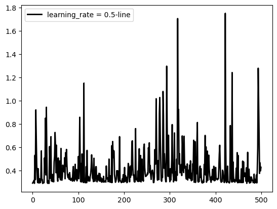


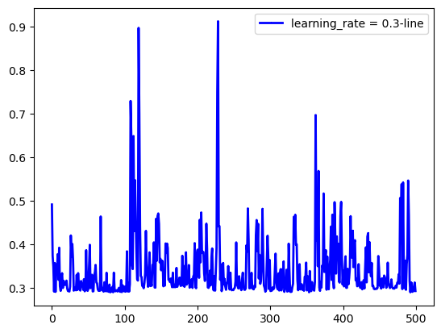


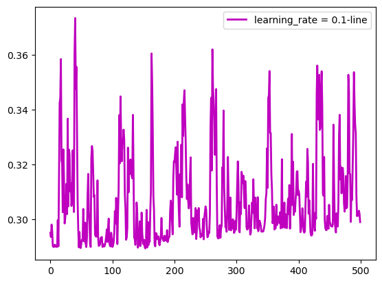


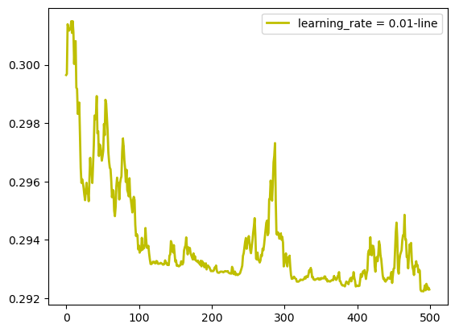


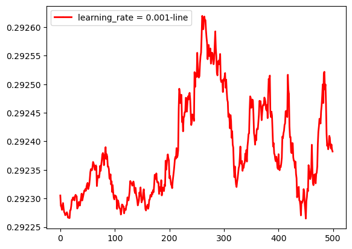


```python
print(np.mat(x_train).shape)  # 16个数据，6个特征
print(np.mat(y_train).shape)  # 16个数据
```

    (3918, 12)
    (1, 3918)
    


```python
# 岭回归标准方程法求解回归参数
def weights(xArr, yArr, lam = 0.2):  # 设置岭系数为0.2
    xMat = np.mat(xArr)
    yMat = np.mat(yArr)

    xTx = xMat.T * xMat  # 矩阵乘法
    rxTx = xTx + np.eye(xMat.shape[1]) * lam  # 岭回归求解的括号的部分
    # 计算矩阵的值,如果值为0，说明该矩阵没有逆矩阵
    if np.linalg.det(rxTx) == 0.0:
        print("This matrix cannot do inverse")
        return
    # xTx.I为xTx的逆矩阵
    ws = rxTx.I * xMat.T * yMat.T
    return ws


ws = weights(x_train, y_train)
print(ws)
print('-----------------------------------------------------------------------------------')
l = 0.001
# 测试不同系数所对应的训练损失和测试损失值
for i in range(0, 10):
    ws = weights(x_train, y_train, l)
    train_loss = compute_cost(x_train, y_train, ws)
    test_loss = compute_cost(x_test, y_test, ws)
    l *= 10
    print(train_loss)
    print(test_loss)
    
    print('-----------------------------------------------------------------------------------')

# # 计算预测值
# print(np.mat(data0)*np.mat(ws))
```

    [[ 5.87651261]
     [ 0.13892945]
     [-1.9326619 ]
     [ 0.0103048 ]
     [ 3.93627401]
     [-0.16148061]
     [ 1.05980356]
     [-0.06315834]
     [-4.58856789]
     [ 0.50100222]
     [ 0.46973739]
     [ 1.67914811]]
    -----------------------------------------------------------------------------------
    [[0.28196033]]
    [[0.28100224]]
    -----------------------------------------------------------------------------------
    [[0.28196256]]
    [[0.28105634]]
    -----------------------------------------------------------------------------------
    [[0.28210954]]
    [[0.28157773]]
    -----------------------------------------------------------------------------------
    [[0.28383004]]
    [[0.28387014]]
    -----------------------------------------------------------------------------------
    [[0.28838999]]
    [[0.28666535]]
    -----------------------------------------------------------------------------------
    [[0.32815246]]
    [[0.32371329]]
    -----------------------------------------------------------------------------------
    [[1.08494255]]
    [[1.08305258]]
    -----------------------------------------------------------------------------------
    [[9.30757282]]
    [[9.30604805]]
    -----------------------------------------------------------------------------------
    [[16.38905887]]
    [[16.38703221]]
    -----------------------------------------------------------------------------------
    [[17.5328268]]
    [[17.53071112]]
    -----------------------------------------------------------------------------------
    


```python

```
